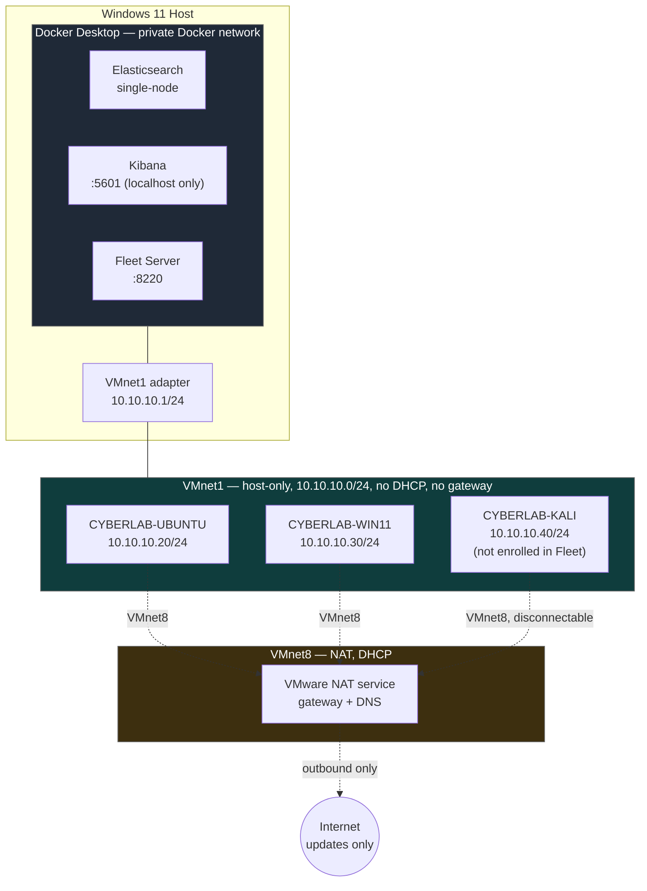
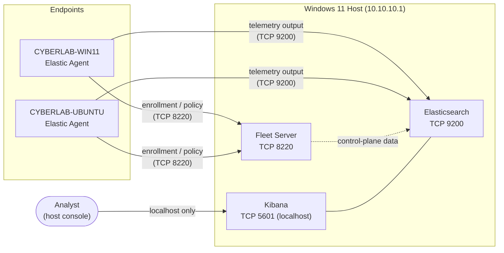

# Network Topology

## 1. Purpose

This document defines the network design for the Home SIEM lab: the virtual network segments in use, the addressing plan for the host and each virtual machine, how Elastic Agents communicate with Fleet Server and Elasticsearch, and the planned host firewall posture. It exists so that every IP address, port, and routing decision in the lab has a documented rationale before any service is deployed or any firewall rule is applied.

This is a design document. No firewall rules described here have been created or executed, and no connectivity tests described here have been run yet — both are planned work, recorded ahead of implementation so the intended state is clear.

## 2. Network Segments

The lab uses two VMware virtual networks, each with a distinct, non-overlapping purpose. No bridged adapters are used anywhere in the lab, so no lab VM or service is ever placed directly on the physical home network.

| Segment | Type | Subnet | DHCP | Purpose |
|---|---|---|---|---|
| VMnet1 | Host-only | `10.10.10.0/24` | Disabled (static) | Internal lab communication; access to Docker-published SIEM services on the host |
| VMnet8 | NAT | Provided by VMware NAT service | Enabled | Outbound-only connectivity for OS updates and package downloads |

- **VMnet1** carries agent management traffic, endpoint telemetry, and controlled communication between lab systems. The analyst interface remains local to the Windows host. VMnet1 has no route to the internet and no relationship to the host's physical network adapter.
- **VMnet8** exists solely to let each VM reach the internet for updates. It is not used for any SIEM-related traffic and is treated as untrusted from the lab's perspective.

## 3. Addressing Plan

All VMnet1 addressing is static and assigned by design, not by DHCP. VMnet8 addressing is dynamic (DHCP), since its only purpose is outbound update traffic.

| Address | Host / Role | Status |
|---|---|---|
| `10.10.10.1` | Windows 11 host (VMware VMnet1 adapter) | Confirmed |
| `10.10.10.10` | Reserved infrastructure address | Reserved |
| `10.10.10.20` | CYBERLAB-UBUNTU | Planned |
| `10.10.10.30` | CYBERLAB-WIN11 | Planned |
| `10.10.10.40` | CYBERLAB-KALI | Planned |
| `10.10.10.50` | Future Active Directory domain controller | Reserved |
| `10.10.10.60` | Future Active Directory client | Reserved |
| `10.10.10.70` | Future honeypot | Reserved |
| `10.10.10.80` – `10.10.10.99` | Future security tools | Reserved |

`10.10.10.1` is the only address confirmed against the running host adapter to date. All other addresses in this plan are design intent and will move from "Planned" to "Confirmed" as each VM is built and validated (Section 10). The `10.10.10.0/24` block is otherwise unallocated, leaving room to expand the addressing plan as future projects (Section 12) are added.

## 4. Virtual Machine Interfaces

Each VM has two network interfaces: one on VMnet8 for outbound connectivity, and one on VMnet1 for internal lab communication. VMnet1 interfaces are statically addressed and intentionally configured with no gateway or DNS server.

### CYBERLAB-UBUNTU

| Interface | Network | Addressing | Gateway | DNS |
|---|---|---|---|---|
| VMnet8 | NAT | DHCP | Provided by VMware NAT | Provided by VMware NAT |
| VMnet1 | Host-only | `10.10.10.20/24` (static) | None | None |

### CYBERLAB-WIN11

| Interface | Network | Addressing | Gateway | DNS |
|---|---|---|---|---|
| VMnet8 | NAT | DHCP | Provided by VMware NAT | Provided by VMware NAT |
| VMnet1 | Host-only | `10.10.10.30/24` (static) | None | None |

### CYBERLAB-KALI

| Interface | Network | Addressing | Gateway | DNS |
|---|---|---|---|---|
| VMnet8 | NAT | DHCP; disconnectable during isolated tests | Provided by VMware NAT | Provided by VMware NAT |
| VMnet1 | Host-only | `10.10.10.40/24` (static) | None | None |

CYBERLAB-KALI is not enrolled in Fleet. It is the lab's controlled test workstation and is treated as an untrusted host on VMnet1 — present on the same segment as the monitored endpoints so it can generate observable traffic and activity, but never a source of managed telemetry.

## 5. Routing and DNS

- **VMnet8 is the only source of a default gateway.** Every VM's default route points out through its VMnet8 adapter, provided by the VMware NAT service.
- **VMnet1 interfaces have no gateway.** They exist purely for direct, same-subnet communication with the host and other lab VMs; there is no need for, and no configuration of, off-subnet routing on this segment.
- **VMnet8 supplies DNS** for each VM, used only to resolve names needed for OS and package updates.
- **Internal lab traffic uses VMnet1 static addresses exclusively.** Agent enrollment, telemetry, and analyst access are all addressed directly by VMnet1 IP (e.g., `10.10.10.1`), never by hostname resolution or via VMnet8.
- No routing between VMnet8 and VMnet1 is intentionally configured. IP forwarding, Internet Connection Sharing, and VMware NAT port forwarding must remain disabled unless explicitly required and documented; this assumption is validated by test 12 (Section 10) rather than taken for granted.

## 6. Elastic Communication Flows

Fleet Server and Elasticsearch serve distinct purposes and are addressed separately by design, even though both are reached through the same host address (`10.10.10.1`):

- **Fleet Server** is the agent management control plane. Elastic Agents enroll with it and receive their centrally managed policies over TCP 8220.
- **Elasticsearch** is the telemetry destination. Once enrolled and configured, each Elastic Agent sends its collected security data directly to the Elasticsearch output over TCP 9200 — this traffic does not pass through Fleet Server.
- **Kibana** provides the analyst interface over TCP 5601. It is initially bound to localhost on the host only, and is not exposed to VMnet1 in the lab's current design.
- Elasticsearch, Kibana, and Fleet Server communicate with each other over a private Docker network on the host; this inter-container traffic never traverses VMnet1 or VMnet8.
- TLS will be required for Elastic Agent-to-Fleet-Server and Agent-to-Elasticsearch communication. Certificate issuance and management design is deferred to a later document and is out of scope here.

### Diagram: High-Level Network Topology

### Diagram: Elastic Management and Telemetry Flows

## 7. Port Exposure Matrix

| Service | Planned binding | Intended clients |
|---|---|---|
| Fleet Server | `10.10.10.1:8220` | CYBERLAB-WIN11 and CYBERLAB-UBUNTU, over VMnet1 |
| Elasticsearch | `10.10.10.1:9200` | CYBERLAB-WIN11 and CYBERLAB-UBUNTU, over VMnet1 |
| Kibana | `127.0.0.1:5601` | Analyst browser on the host |

This table describes intended reachability, not a validated state. The effective exposure will be verified after deployment using host socket inspection, firewall inspection, and connectivity tests from each network segment (Section 10). No lab service is intended to be bound to, or reachable through, the host's physical network adapter.

### Planned Docker Host Bindings

By default, publishing a container port without an explicit host address (for example `"9200:9200"`) binds it on every interface of the host, including the physical adapter. To avoid this, each SIEM container's published port must be bound to a specific host address in Docker Compose:

| Service | Planned host binding |
|---|---|
| Fleet Server | `10.10.10.1:8220` |
| Elasticsearch | `10.10.10.1:9200` |
| Kibana | `127.0.0.1:5601` |

These bindings must be enforced in Docker Compose in addition to the Windows Defender Firewall rules in Section 8. Neither control is treated as sufficient on its own — the design relies on explicit Docker host bindings, host firewall rules, and VMnet1 network isolation together (defense in depth), not on any single layer.

## 8. Host Firewall Design

The following Windows Defender Firewall rules are **planned** for the Windows 11 host. They describe the intended inbound posture; none have been created or applied as of this document.

- Permit inbound TCP 8220 (Fleet Server) only from `10.10.10.0/24`, scoped to the VMnet1 adapter.
- Permit inbound TCP 9200 (Elasticsearch) only from `10.10.10.0/24`, scoped to the VMnet1 adapter.
- Do not create any inbound allowance for Elasticsearch, Fleet Server, or Kibana on any adapter other than VMnet1.
- Keep Kibana bound to localhost and excluded from inbound firewall rules entirely, unless a future requirement explicitly justifies exposing it to VMnet1.
- All other inbound traffic to these services remains denied by default.

Firewall rule creation and testing will be tracked as separate implementation work once the Docker Compose deployment (see `01-lab-overview.md`) is in place.

## 9. Isolation Controls

- **No bridged adapters.** Every VM interface is attached to either VMnet1 (host-only) or VMnet8 (NAT); none are bridged to the host's physical network hardware.
- **VMnet1 has no default gateway**, so lab-internal traffic has no path off-segment and cannot be inadvertently routed toward the internet or the physical home network.
- **VMnet8 is restricted by policy to update traffic.** It provides NAT-based outbound connectivity for operating-system updates and package downloads. No Elastic service will intentionally be published or accessed through VMnet8, and VMware NAT port forwarding is not used.
- **Kali's VMnet8 adapter is disconnectable.** During detection tests that do not require internet access, the NAT adapter can be disconnected so CYBERLAB-KALI communicates only over VMnet1, reducing the chance of test traffic leaving the lab.
- **Kali is excluded from Fleet enrollment**, keeping the adversary-role host logically separate from the set of monitored, managed endpoints.
- **Elasticsearch and Fleet Server are scoped to VMnet1 only**, and Kibana is scoped to host localhost only — neither is exposed to VMnet8, the physical home network, or the internet.

## 10. Connectivity Validation Plan

The following tests are planned to validate this design once the environment is built. They are recorded here for completeness; none have been executed yet.

1. Verify each VM presents both expected interfaces (one VMnet8, one VMnet1).
2. Verify static VMnet1 addressing on each VM matches the addressing plan (Section 3).
3. Attempt ICMP reachability to `10.10.10.1` from each VM as an optional diagnostic test only — ICMP may be blocked independently of service health.
4. Treat successful TCP connectivity to ports 8220 and 9200 as the authoritative service-reachability test, not ICMP. Test TCP 8220 connectivity to `10.10.10.1` from CYBERLAB-WIN11 and CYBERLAB-UBUNTU.
5. Test TCP 9200 connectivity to `10.10.10.1` from CYBERLAB-WIN11 and CYBERLAB-UBUNTU.
6. Verify Kibana is reachable and functional from the host at `localhost:5601`.
7. Confirm Kibana is **not** reachable from any VM over VMnet1.
8. Confirm each VM can reach the internet and complete package/OS updates through VMnet8.
9. Disconnect CYBERLAB-KALI's VMnet8 adapter and confirm it can still reach lab targets over VMnet1.
10. Confirm no lab service (Elasticsearch, Fleet Server, or Kibana) is reachable through the host's physical network interface.
11. Inspect host listening sockets and confirm each service is bound only to its planned address (Section 7): TCP 8220 and TCP 9200 listening only on `10.10.10.1`, and TCP 5601 listening only on `127.0.0.1`.
12. Verify that IP forwarding and Internet Connection Sharing are disabled between VMnet1, VMnet8, and the physical network adapter.

These tests are design intent only; no commands have been run and no service, certificate, or firewall rule exists yet to test against. When this plan moves to execution, TCP checks are expected to use standard OS-native tooling (e.g., `Test-NetConnection` on Windows for tests 4–5, socket-listing tools such as `Get-NetTCPConnection` for test 11), and any Elasticsearch check will require TLS and a trusted CA once certificates are introduced (see Section 6).

## 11. Risks and Mitigations

| Risk | Mitigation |
|---|---|
| A Docker Compose port publish without an explicit host address exposes a container on every host interface, including the physical adapter | Each SIEM container binds to an explicit host address (`10.10.10.1` or `127.0.0.1`) rather than a bare port publish (Section 7); validated by test 11 (Section 10) |
| A misconfigured firewall rule exposes Elasticsearch or Fleet Server beyond VMnet1 | Rules are scoped explicitly to the VMnet1 adapter and `10.10.10.0/24` source range (Section 8); validated by test 10 (Section 10) |
| Kali generates traffic that reaches the internet or the physical network during a test | Kali's VMnet8 adapter is disconnectable and no bridged adapter exists (Section 9); validated by test 9 |
| Kibana becomes reachable from VMnet1 through a configuration change | Kibana remains excluded from firewall allowances by default (Section 8); validated by test 7 |
| Address collisions as future VMs are added | Reserved address ranges (Section 3) are defined in advance for known future projects |
| Elastic Agent-to-Fleet-Server or Agent-to-Elasticsearch traffic is unencrypted | TLS is required for both flows; certificate design is deferred to a dedicated follow-up document |
| VMnet1 static addressing drifts from this document over time | Addressing plan (Section 3) serves as the single source of truth and should be updated alongside any VM network change |

## 12. Future Expansion

The reserved address ranges in Section 3 anticipate the same future projects introduced in `01-lab-overview.md`:

- `10.10.10.50` and `10.10.10.60` reserve space for the **Active Directory Attack and Defend Lab** (domain controller and client).
- `10.10.10.70` reserves space for the **Honeypot Dashboard** project.
- `10.10.10.80`–`10.10.10.99` reserve a block for future security tooling, including the **Automated CVE Scanner** and **SOAR Automation** projects.

As these projects are implemented, this document should be revised to assign specific addresses, define any new firewall rules, and extend the connectivity validation plan accordingly.
