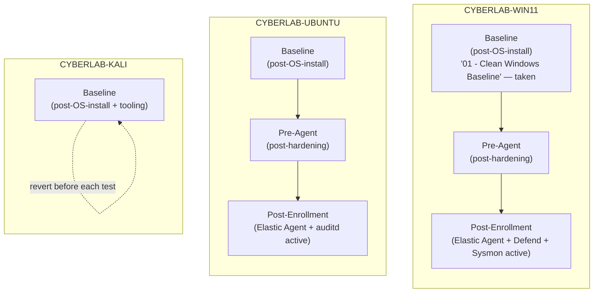

# Virtual Machine Specifications

## 1. Purpose

This document specifies the virtual infrastructure planned to support the Home SIEM lab: host hardware capacity, the virtualization platform, and the configuration of each virtual machine (CYBERLAB-WIN11, CYBERLAB-UBUNTU, CYBERLAB-KALI). It records resource allocation, storage layout, snapshot strategy, and the software each VM is intended to run, along with the reasoning behind each decision.

This is a design document. CYBERLAB-WIN11 has been created and its baseline validated (Section 4); CYBERLAB-UBUNTU and CYBERLAB-KALI remain undeployed, and no software listed for any VM in this document has been installed. Deployment steps, installation media handling, and configuration commands are intentionally out of scope and belong to later, implementation-focused documents.

### VM Roles

| VM | Role | Monitored | Status |
|---|---|---|---|
| CYBERLAB-WIN11 | Endpoint | Yes | Implemented |
| CYBERLAB-UBUNTU | Endpoint | Yes | Planned |
| CYBERLAB-KALI | Adversary | No | Planned |

## 2. Host Hardware

| Component | Specification |
|---|---|
| Operating System | Windows 11 |
| CPU | AMD Ryzen 7 5700G |
| CPU Topology | 8 cores / 16 logical processors |
| RAM | 32 GB |
| Project Storage | `D:\CyberLab` |

The host provides the physical compute budget that every VM allocation in this document is drawn from. All CPU and RAM figures for individual VMs (Sections 4–6) are sized against this ceiling, not assumed independently.

## 3. Virtualization Platform

| Component | Role |
|---|---|
| VMware Workstation Pro | Hosts and manages the three lab VMs (CYBERLAB-WIN11, CYBERLAB-UBUNTU, CYBERLAB-KALI) |
| Docker Desktop (WSL2 backend) | Hosts the Elastic Stack containers (Elasticsearch, Kibana, Fleet Server) directly on the Windows host, as described in `01-lab-overview.md` |

VMware Workstation Pro and Docker Desktop run side by side on the same host and draw from the same shared CPU and RAM pool. This coexistence is a first-order constraint on every sizing decision in Section 7 — capacity is planned for both workloads simultaneously, not for the VMs in isolation.

## 4. Windows Endpoint Specification

| Attribute | Value |
|---|---|
| Hostname | CYBERLAB-WIN11 |
| Guest OS | Windows 11 Enterprise Evaluation |
| vCPU | 4 (1 virtual processor × 4 cores) |
| RAM | 8 GB |
| Disk | 64 GB NVMe, thin provisioned |
| Firmware | UEFI |
| TPM | Virtual TPM, enabled |
| Secure Boot | Enabled |
| VMware Tools | Installed |
| Windows Update status | Fully updated |
| Baseline snapshot | "01 - Clean Windows Baseline" |
| NIC 1 | VMnet8, DHCP |
| NIC 2 | VMnet1, static — `192.168.72.20/24` (see `02-network-topology.md`) |

*Note: Windows 11 Enterprise Evaluation provides the same Enterprise-edition feature set (Defender, Group Policy-style controls, Event Logs) referenced in the rationale below; it is the edition actually installed on this VM, not merely the installation medium.*

**Rationale:** Windows 11 Enterprise is used because it is a full-featured Enterprise SKU, matching the endpoint hardening and telemetry surface (Defender, Event Logs, Group Policy-style controls) that the lab intends to monitor. UEFI, virtual TPM, and Secure Boot are enabled because they are Windows 11 platform requirements and because they keep the guest representative of a modern, hardened enterprise endpoint — the same class of host that Elastic Defend and Sysmon are designed to instrument. This VM carries the highest RAM allocation of the three (8 GB) because a full Windows desktop OS, combined with Elastic Agent, Elastic Defend, and Sysmon's event generation, has materially higher baseline memory needs than the headless Linux roles.

**Implementation status:** CYBERLAB-WIN11 has been created and its baseline validated against every attribute above — including UEFI, Secure Boot, virtual TPM, VMware Tools, a fully updated OS, and static VMnet1 addressing with confirmed host connectivity (`02-network-topology.md`, Section 10). The baseline snapshot "01 - Clean Windows Baseline" has been taken. Monitoring components (Elastic Agent, Elastic Defend, Sysmon, PowerShell logging — Section 11) are not yet installed; that work is tied to the pending Elastic Stack deployment.

## 5. Ubuntu Endpoint Specification

| Attribute | Value |
|---|---|
| Hostname | CYBERLAB-UBUNTU |
| Guest OS | Ubuntu Server 24.04 LTS |
| vCPU | 2 |
| RAM | 2 GB |
| Disk | 32 GB, thin provisioned |
| Firmware | UEFI |
| NIC 1 | VMnet8, DHCP |
| NIC 2 | VMnet1, static — `192.168.72.30/24` (see `02-network-topology.md`) |

**Rationale:** Ubuntu Server is a headless, minimal-footprint installation with no desktop environment, so it is sized well below the Windows endpoint. Its planned role — running Elastic Agent, auditd, and a small set of command-line utilities — does not require significant compute or memory headroom. 2 GB of RAM is enough for the base OS and these services while keeping the VM's footprint small relative to the 32 GB host budget shared with Docker Desktop and the other VMs.

## 6. Kali Workstation Specification

| Attribute | Value |
|---|---|
| Hostname | CYBERLAB-KALI |
| Guest OS | Kali Linux |
| vCPU | 2 |
| RAM | 4 GB |
| Disk | 40 GB, thin provisioned |
| Firmware | UEFI |
| NIC 1 | VMnet8, DHCP (disconnectable during isolated tests, see `02-network-topology.md`) |
| NIC 2 | VMnet1, static — `192.168.72.40/24` (see `02-network-topology.md`) |

**Rationale:** Kali is not enrolled in Fleet and carries no monitoring workload of its own — its role is to generate adversary activity for the monitored endpoints and detection rules to observe. It is allocated more RAM than Ubuntu (4 GB vs. 2 GB) because its planned toolset (Nmap, NetExec, Impacket, Responder) is heavier and more interactive than Ubuntu's minimal service set, but less than the Windows endpoint because it does not run a full monitored desktop stack or endpoint agent. A 40 GB disk provides headroom for tool output, captured traffic, and engagement artifacts without approaching the size allocated to the Windows endpoint.

## 7. Resource Allocation Rationale

| Resource | Windows | Ubuntu | Kali | Total Allocated | Host Capacity | Headroom |
|---|---|---|---|---|---|---|
| vCPU | 4 | 2 | 2 | 8 | 16 logical processors | 8 logical processors |
| RAM | 8 GB | 2 GB | 4 GB | 14 GB | 32 GB | 18 GB |
| Disk (thin) | 64 GB | 32 GB | 40 GB | 136 GB | Limited by `D:\CyberLab` free space | Determined at deployment time |

The allocation is deliberately conservative relative to host capacity:

- **CPU:** 8 of 16 logical processors are assigned across all three VMs combined, leaving the remaining 8 for the host OS, VMware Workstation Pro's own overhead, and Docker Desktop's WSL2-hosted Elastic Stack (Elasticsearch, Kibana, Fleet Server) running concurrently.
- **RAM:** 14 of 32 GB are assigned to VMs, leaving 18 GB for the host OS and Docker Desktop. This headroom matters because Elasticsearch, even as a single-node lab cluster, benefits from consistent memory availability, and RAM contention between VMware and Docker Desktop is the most likely source of lab-wide performance degradation.
- **Disk:** All three disks are thin provisioned, so the 136 GB combined maximum is not reserved up front — actual consumption grows with use and is expected to remain well below the maximum for most of the lab's operating life. Thin provisioning is chosen specifically because none of the three VMs is expected to approach its maximum size under normal lab operation, and reclaiming unused space is preferable to pre-allocating it.

No VM is sized to be able to consume the entire host budget on its own; each individual allocation, and the combined total, leaves deliberate slack for the host and for Docker Desktop.

## 8. Snapshot Strategy

Each VM follows a snapshot lineage designed around its role in the lab: monitored endpoints (Windows, Ubuntu) are snapshotted around stable, known-good states so telemetry baselines can be restored if a configuration change breaks agent enrollment or logging; the Kali workstation is snapshotted so it can be repeatedly reverted to a clean pre-engagement state between detection tests, keeping test conditions repeatable.

| VM | Planned snapshot points | Purpose |
|---|---|---|
| CYBERLAB-WIN11 | Post-OS-install baseline ("01 - Clean Windows Baseline", taken); post-hardening/pre-agent; post-agent-enrollment | Preserve rollback points around the riskiest configuration changes (hardening, agent install) |
| CYBERLAB-UBUNTU | Post-OS-install baseline; post-hardening/pre-agent; post-agent-enrollment | Same rationale as Windows, applied to the Linux endpoint |
| CYBERLAB-KALI | Post-OS-install / post-tooling baseline | A single clean baseline to revert to before each detection test, keeping test runs independent of one another |

### Diagram: Snapshot Strategy



Snapshots are treated as rollback points tied to lab milestones, not as a substitute for the storage or backup layout described in Section 10.

## 9. VM Lifecycle

Every virtual machine in the lab is intended to progress through the same engineering lifecycle, regardless of its role:

```
Planning
   ↓
Creation
   ↓
Baseline Snapshot
   ↓
Hardening
   ↓
Monitoring Components
   ↓
Validation
   ↓
Ready for Detection Engineering
   ↓
Production-Inspired Lab State
```

This lifecycle applies with one adjustment for CYBERLAB-KALI: it has no "Monitoring Components" stage, since it is never enrolled in Fleet (see Section 6 and the VM Roles table in Section 1). Its lifecycle instead moves from Hardening directly to Validation and Ready for Detection Engineering, reflecting its role as the lab's adversary workstation rather than a monitored endpoint.

The lifecycle is a planning reference. CYBERLAB-WIN11 has progressed through Creation and Baseline Snapshot (Section 4) and is ready to begin Hardening. CYBERLAB-UBUNTU and CYBERLAB-KALI remain at the Planning stage as of this document.

## 10. Storage Layout

All lab assets live under `D:\CyberLab`, organized by function rather than by VM:

| Path | Contents |
|---|---|
| `D:\CyberLab\Virtual Machines` | VM disk files and VMware configuration for CYBERLAB-WIN11, CYBERLAB-UBUNTU, CYBERLAB-KALI |
| `D:\CyberLab\ISOs` | Installation media for guest operating systems |
| `D:\CyberLab\Snapshots` | Optional location reserved for exported snapshots, VM clones, or archived recovery points (see Section 8) |
| `D:\CyberLab\Backups` | Longer-term backup copies, distinct from point-in-time snapshots |
| `D:\CyberLab\Shared` | Files shared between the host and lab VMs |
| `D:\CyberLab\home-siem` | Project documentation, configuration, and scripts for the Home SIEM project itself |

Native VMware snapshot files (`.vmsd`, `.vmsn`, and `-delta.vmdk` files) remain alongside each virtual machine's own files under `D:\CyberLab\Virtual Machines`, which is where VMware Workstation Pro creates and manages them by default. `D:\CyberLab\Snapshots` is not their native location — it is reserved for explicitly exported snapshots, VM clones, or archived recovery points that are deliberately separated from the live VM.

Separating VM disks, installation media, snapshot exports, and backups into distinct top-level directories keeps the project storage predictable as the lab grows, and keeps large, regenerable assets (ISOs, exported snapshots) clearly distinguished from the durable project artifacts under `home-siem`.

## 11. Planned Software Components

No software listed below has been installed. These are the intended components for each VM once deployment begins.

### Windows (CYBERLAB-WIN11)

| Component | Role |
|---|---|
| Fleet-managed Elastic Agent | Centrally managed telemetry shipping to Elasticsearch |
| Elastic Defend | Endpoint detection and response telemetry |
| Sysinternals Sysmon | High-fidelity Windows telemetry, including process creation, network connections, driver loading, registry activity, image loads, and file creation events |
| PowerShell Logging | Script block and module logging for PowerShell activity |
| Windows Security, System, Application and PowerShell Event Logs | Native OS event telemetry across the core Windows logging channels |

### Ubuntu (CYBERLAB-UBUNTU)

| Component | Role |
|---|---|
| Fleet-managed Elastic Agent | Centrally managed telemetry shipping to Elasticsearch |
| auditd | Linux audit framework for system call and file-access telemetry |
| OpenSSH Server | Remote administration access |
| curl | Command-line HTTP/S client for connectivity checks and lightweight testing |
| tcpdump | Packet capture for traffic inspection and validation |

### Kali (CYBERLAB-KALI)

| Component | Role |
|---|---|
| Nmap | Network and service discovery |
| NetExec | Post-exploitation and lateral movement testing against Windows/AD-style targets |
| Impacket | Protocol-level attack and testing toolkit |
| Responder | LLMNR/NBT-NS/mDNS poisoning for credential-capture testing |
| tcpdump | Packet capture for traffic inspection and validation |
| curl | Command-line HTTP/S client for connectivity checks and lightweight testing |

Kali's toolset is intentionally offensive-only; it carries no Elastic Agent and no monitoring role, consistent with its position as the lab's controlled test workstation (Sections 6 and 9 of `02-network-topology.md`).

## 12. Future Expansion

The VM specifications in this document are scoped to the current three-endpoint lab. As the future projects introduced in `01-lab-overview.md` and reserved in `02-network-topology.md` are implemented, additional VMs will be specified following the same format used in Sections 4–6 (role, resource allocation with rationale, storage, and planned software):

- **Active Directory Attack and Defend Lab** — a domain controller and a domain-joined client VM, reserved at `192.168.72.50` and `192.168.72.60`.
- **Automated CVE Scanner** — likely hosted on lightweight infrastructure within the reserved `192.168.72.80`–`192.168.72.99` tooling block, rather than as a dedicated heavyweight VM.
- **SOAR Automation** — automation components reserved within the same `192.168.72.80`–`192.168.72.99` block.
- **Honeypot Dashboard** — a decoy-service VM reserved at `192.168.72.70`.

Each future VM's resource allocation will need to be re-evaluated against the host headroom identified in Section 7, since that headroom — not just raw host capacity — is what remains available for expansion.
