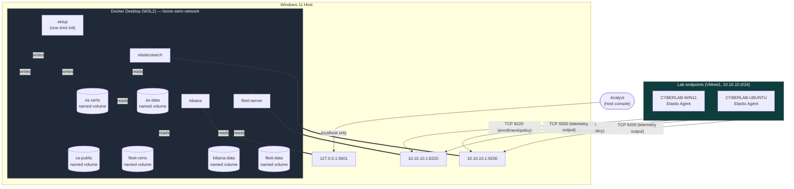
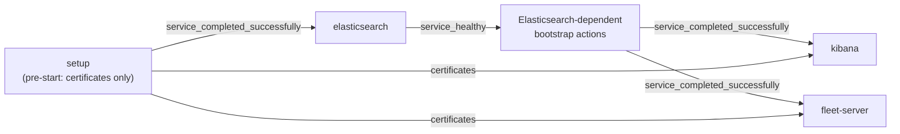

# Docker Architecture

## 1. Purpose

This document defines the planned Docker Compose architecture for the self-managed Elastic Stack that underpins the Home SIEM lab: the containerized services, how they depend on and communicate with each other, their network and storage design, TLS and secrets handling, and the criteria that will be used to validate the deployment once it exists.

This is a design document. No Docker Compose file, script, certificate, or secret has been created. No container described here is running. Everything in this document describes intended architecture, to be implemented in a later, deployment-focused phase.

## 2. Architecture Overview

The Elastic Stack is planned to run as a set of Docker containers, managed by Docker Compose, on Docker Desktop using the WSL2 backend on the Windows 11 host. This keeps the stack colocated with the host's VMware VMnet1 adapter (`10.10.10.1`), which is how the lab's monitored VMs (CYBERLAB-WIN11, CYBERLAB-UBUNTU) are intended to reach it, as established in `02-network-topology.md`.

Four logical services make up the planned stack:

- **setup** — a temporary, one-shot initialization service.
- **elasticsearch** — the single-node data store for all lab telemetry.
- **kibana** — the analyst and Fleet management interface.
- **fleet-server** — the management control plane for Fleet-managed Elastic Agents.

These services are designed to communicate with each other over a private, user-defined Docker network, and to expose only the specific ports each lab VM or the analyst actually needs, bound to specific host addresses rather than published broadly.

### Diagram: Component Architecture

## 3. Container Services

| Service | Image basis | Lifecycle |
|---|---|---|
| `setup` | Elasticsearch-family tooling image, used only for initialization | One-shot; exits after successful completion |
| `elasticsearch` | Official Elasticsearch image | Long-running |
| `kibana` | Official Kibana image | Long-running |
| `fleet-server` | Official Elastic Agent image, with Fleet Server enabled | Long-running |

All four services are planned to share a single `STACK_VERSION` value (Section 16), so the Elasticsearch, Kibana, and Elastic Agent/Fleet Server images stay on a mutually compatible Elastic Stack version.

## 4. Service Responsibilities

| Service | Responsibilities |
|---|---|
| `setup` | Handle pre-start initialization that does not require a running Elasticsearch node — primarily generating a private lab certificate authority if one does not already exist, and generating service certificates with the required Subject Alternative Names (Section 9), then distributing them into the per-service certificate volumes (Section 8); exit successfully once this pre-start initialization is complete; remain idempotent so valid existing certificate material is not overwritten |
| `elasticsearch` | Store endpoint telemetry, data streams, security detection alerts, Fleet state, and other backend data; serve the HTTPS API consumed by Kibana, Fleet Server, and enrolled Elastic Agents; pass a meaningful health check before dependent services start |
| `kibana` | Provide the analyst interface and Fleet management UI; communicate with Elasticsearch over the private Docker network; remain reachable only from the host; pass its own meaningful health check |
| `fleet-server` | Act as the management control plane for Fleet-managed Elastic Agents; handle enrollment, policy retrieval, status reporting, and management actions; present an HTTPS endpoint to monitored VMs; trust the Elasticsearch CA and present a certificate trusted by enrolled agents |

Endpoint telemetry itself is not among Fleet Server's responsibilities: once an Elastic Agent is enrolled and configured, it sends telemetry directly to the Elasticsearch output, not through Fleet Server. This mirrors the flow already documented in `02-network-topology.md`, Section 6.

Any bootstrap action that requires the Elasticsearch API — for example, configuring built-in users or passwords, or other API-driven setup — must occur only after Elasticsearch is healthy, since Elasticsearch cannot answer API calls before it is running. `setup` as scoped above deliberately excludes this class of action to avoid a circular dependency where `setup` would need to both finish before Elasticsearch starts and call an API that only exists once Elasticsearch has started. The final implementation may use a separate post-start initialization service, or an explicitly separated second phase of initialization, to perform this Elasticsearch-dependent bootstrap work; the exact mechanism is deferred to the implementation phase.

## 5. Startup and Dependency Model

The planned startup order reflects real dependencies, not just container start order — a container reporting "running" is not treated as equivalent to the service being usable:

1. Pre-start certificate initialization (`setup`) completes successfully.
2. `elasticsearch` starts and becomes healthy.
3. Elasticsearch-dependent bootstrap actions (built-in users/passwords and any other API-driven setup, per Section 4) complete successfully.
4. `kibana` starts only after Elasticsearch and its required bootstrap state (step 3) are ready.
5. `fleet-server` starts only after Elasticsearch and its required Fleet bootstrap state are ready.

Conceptually, this maps to two different kinds of Docker Compose dependency condition: a condition equivalent to "**service completed successfully**" for the relationship between each one-shot initialization step and the services that depend on its output, and a condition equivalent to "**service healthy**" for the relationship between `elasticsearch` and `kibana`/`fleet-server`. No exact Compose YAML or `depends_on` syntax is specified here — that belongs to the implementation phase.

### Diagram: Startup Dependency Model

## 6. Docker Network Design

All four services are planned to attach to a single private, user-defined bridge network named `home-siem-network`.

- Inter-container communication uses Docker service names, not IP addresses: Elasticsearch is addressed internally as `elasticsearch`, Kibana as `kibana`, and Fleet Server as `fleet-server`.
- Fixed Docker container IP addresses are not used; the network relies on Docker's internal DNS resolution of service names instead.
- Docker-internal addresses must never appear in endpoint configuration on the monitored VMs — CYBERLAB-WIN11 and CYBERLAB-UBUNTU are configured against `10.10.10.1` (Section 7), never against a Docker network address, since Docker's internal addressing is not reachable from VMnet1.
- `home-siem-network` is entirely separate from the VMware networks described in `02-network-topology.md`: it has no relationship to VMnet1 (`10.10.10.0/24`) or VMnet8, and traffic on it never traverses either VMware network. The only bridge between the two network layers is the set of explicit host port bindings in Section 7.

## 7. Host Port Bindings

| Service | Planned host binding | Reachable from |
|---|---|---|
| Elasticsearch | `10.10.10.1:9200:9200` | VMnet1 (`10.10.10.0/24`) |
| Fleet Server | `10.10.10.1:8220:8220` | VMnet1 (`10.10.10.0/24`) |
| Kibana | `127.0.0.1:5601:5601` | Host loopback only |

Each binding pins a container's published port to one specific host address rather than publishing it on every host interface. This is a deliberate security control, not an implementation detail: Docker's default behavior when a port is published without an explicit host address is to bind it on all host interfaces, including the physical adapter. Explicit host-address binding is designed to work together with, not instead of, the Windows Defender Firewall rules planned in `02-network-topology.md` — the two controls are complementary layers, consistent with the defense-in-depth approach already established there.

Elasticsearch's transport port (9300) is not published to the host under this design; it is used only for internal Elasticsearch node communication, which this single-node deployment does not require to be exposed anywhere. These bindings describe intended configuration only — none are active, since no container has been created.

## 8. Persistent Storage Design

Docker named volumes are the preferred design for any state a service owns and needs to survive container recreation.

| Volume | Owner | Contents |
|---|---|---|
| `es-data` | `elasticsearch` | Elasticsearch data, indices, data streams, and cluster state |
| `certs` | `setup` (writer, generation-time only) | Generated CA certificate and all generated service certificates/keys, before they are distributed to per-service volumes below |
| `ca-public` | `setup` (writer), `elasticsearch`/`kibana`/`fleet-server` (readers) | Public CA certificate only — no private key material |
| `es-certs` | `setup` (writer), `elasticsearch` (reader) | Elasticsearch's own certificate and private key |
| `fleet-certs` | `setup` (writer), `fleet-server` (reader) | Fleet Server's own certificate and private key |
| `kibana-certs` | `setup` (writer), `kibana` (reader) | Kibana's own certificate, once a Kibana browser-facing certificate is introduced (Section 9) |
| `kibana-data` | `kibana` | Local Kibana runtime state, UUID, keystore, or other version-dependent files, if required by the deployed version — saved objects, dashboards, rules, and Fleet configuration remain stored primarily in Elasticsearch, not here |
| `fleet-data` | `fleet-server` | Persistent Elastic Agent/Fleet Server state, if required by the deployed version |

A single certificate-generation location (`certs`) may be used by `setup` during initialization, but long-running services are designed to mount only the certificate files and private keys required for their own role, via the per-service volumes above (`ca-public`, `es-certs`, `fleet-certs`, `kibana-certs`) — not the full `certs` volume. Read-only access to a single shared volume does not, by itself, enforce private-key isolation between containers, since any service mounting that volume could read every other service's private key even in read-only mode; splitting the material by service is what actually enforces least privilege here.

Three distinct storage patterns are used deliberately, for different kinds of content:

- **Named volumes** hold service-owned state that a service generates and manages itself — Elasticsearch's indices, generated certificates, Kibana's internal state. This is Docker-managed storage, not a folder the repository or the analyst edits directly.
- **Read-only bind mounts** are reserved for repository-controlled configuration — files that live in version control and are meant to be inspected and edited as part of the project (for example, service configuration templates). Mounting these read-only prevents a container from silently modifying files that are supposed to be source-controlled.
- **Secrets** (Section 10) are neither named volumes nor bind-mounted repository files; they are excluded from version control entirely and are handled through a separate mechanism.

Elasticsearch's data is not mapped to an arbitrary Windows directory under `D:\CyberLab`; it lives in the `es-data` named volume, managed by Docker rather than exposed as a plain folder on the host filesystem. This keeps Elasticsearch's on-disk format and permissions under Docker's control rather than the host's, and avoids the file-locking and permission-translation issues that can occur when a database engine writes directly to a bind-mounted Windows path through WSL2.

`es-data` growth must be controlled through a later retention and lifecycle policy. High-volume sources such as Sysmon, Elastic Defend, auditd, and Windows Event Logs (Section 14) must not be retained indefinitely on the host. The specific retention window is intentionally not set in this document — it depends on measuring real ingestion volume once the stack and its telemetry sources are running, which has not happened yet.

## 9. TLS and Certificate Architecture

The stack is designed around a private lab certificate authority, generated once by the `setup` service (Section 4) and never intended to be a publicly trusted CA.

Design principles:

- **One-way TLS** is the initial model: clients (Kibana, Fleet Server, enrolled Elastic Agents) verify the server's certificate; mutual TLS is not part of the initial design.
- **Full certificate verification** is required everywhere TLS is used. No permanent use of insecure-verification flags (skipping CA validation) is part of this design — any such flag would only ever be acceptable as a temporary, explicitly logged troubleshooting step, never a standing configuration.
- **Distribution of the public CA certificate** to CYBERLAB-WIN11 and CYBERLAB-UBUNTU is required so each monitored endpoint's Elastic Agent can validate the Elasticsearch and Fleet Server certificates it receives.
- **Private keys are restricted** to the services that require them: each service's private key is placed in its own per-service volume (`es-certs`, `fleet-certs`, `kibana-certs` — Section 8), readable only by that service, rather than in a single shared volume all services mount. This is a deliberate design choice, not an assumption — a shared, read-only volume containing every service's key material would let any one service read the others' private keys regardless of read-only mode. Private key material is never intended to leave the Docker environment.
- A Kibana browser-facing certificate is deliberately deferred to a later phase — Kibana's initial exposure is host-loopback only (Section 7), which lowers the urgency of browser-trusted TLS for the first implementation pass.

### Planned Certificate Subject Alternative Names

| Certificate | Required SANs |
|---|---|
| Elasticsearch HTTP | `DNS: elasticsearch`, `DNS: localhost`, `IP: 127.0.0.1`, `IP: 10.10.10.1` |
| Fleet Server | `DNS: fleet-server`, `DNS: localhost`, `IP: 127.0.0.1`, `IP: 10.10.10.1` |

Each certificate carries both a Docker service-name SAN and a VMnet1 SAN because the certificate must validate for two different classes of client: internal Docker clients (Kibana connecting to `elasticsearch`, Fleet Server connecting to `elasticsearch`) resolve and connect using the Docker service name, while external VM clients (CYBERLAB-WIN11, CYBERLAB-UBUNTU) connect using the VMnet1 address `10.10.10.1`. A certificate scoped to only one of these identities would fail verification for the other class of client.

No certificate contents, fingerprints, private key material, or certificate-generation commands are included in this document — those belong to the implementation phase and, for private key material, must never be committed to version control at all (Section 10).

## 10. Secrets and Environment Variables

The repository is planned to contain an `.env.example` file with placeholder values only, documenting which variables a real deployment needs. The real `.env` file — containing actual values — must be excluded from Git.

| Secret / value | Never committed |
|---|---|
| Elastic superuser password | Required |
| `kibana_system` password | Required |
| Fleet Server service token | Required |
| Elastic Agent enrollment tokens | Required |
| API keys | Required |
| Private certificate keys | Required |
| Generated password files | Required |
| Private CA material | Required |

Enrollment tokens and the Fleet Server service token are not interchangeable, and this design treats them as distinct concerns:

- The **Fleet Server service token** authenticates Fleet Server itself to Elasticsearch, so Fleet Server can operate as the management control plane.
- **Elastic Agent enrollment tokens** authenticate an individual agent (on CYBERLAB-WIN11 or CYBERLAB-UBUNTU) to Fleet Server during enrollment, and are typically scoped to a specific Fleet policy.

Neither token type is a substitute for the other, and both are excluded from version control. No example values resembling real passwords, tokens, or secrets are included in this document.

## 11. Health Check Strategy

A running container is not, on its own, evidence that a service is usable — this design treats "running" and "healthy" as distinct states. Each long-running service (`elasticsearch`, `kibana`, `fleet-server`) is planned to have a meaningful health check that reflects whether the service can actually do its job, not merely whether its process is alive:

- **Elasticsearch** is considered healthy only once its API responds in a way that indicates the node (and, by extension, the single-node cluster) is actually ready to serve requests.
- **Kibana** is considered healthy only once it can reach Elasticsearch and serve its own status/readiness signal, not merely once its process has started.
- **Fleet Server** is considered healthy only once it can reach Elasticsearch and has completed its own bootstrap sequence, since it depends on both.

These health checks are what the dependency model in Section 5 relies on — `kibana` and `fleet-server` are designed to wait on Elasticsearch's health check, not on a fixed startup delay or on Elasticsearch's container merely existing.

## 12. Resource Allocation

The following are initial home-lab planning targets, not production sizing guarantees. They are expected to be adjusted once real usage is measured against the running stack.

| Service | Memory target | Notes |
|---|---|---|
| `elasticsearch` | ~4 GB container memory | JVM heap starting point ~2 GB, per common Elasticsearch guidance of roughly half the container memory allocated to heap |
| `kibana` | ~2 GB | |
| `fleet-server` | ~1 GB | |
| `setup` | Minimal, temporary | Exits after initialization; not a steady-state consumer |

Combined, this puts the stack's planning target at roughly 7 GB of container memory, which must coexist with the rest of the host's committed workload: the Windows host OS itself, VMware Workstation Pro, and the three lab VMs (CYBERLAB-WIN11 at 6 GB, CYBERLAB-UBUNTU at 2 GB, CYBERLAB-KALI at 4 GB — see `03-vm-specifications.md`, Section 7). Against the host's 32 GB total, roughly 19 GB is nominally committed to VMs and the Elastic Stack combined, leaving a nominal 13 GB — but this figure is a planning estimate, and actual allocation will be validated once the stack is running rather than assumed from these targets alone.

The remaining nominal memory is not fully allocatable. It must also absorb the Windows host workload, the WSL2 virtual machine, Docker Desktop's own overhead, VMware Workstation Pro's own overhead, filesystem caching, and temporary usage spikes — none of which are accounted for as a separate line item above. A WSL2 memory ceiling will be evaluated during implementation, so that Docker Desktop cannot expand its memory consumption without an explicit upper bound; the specific ceiling value is deferred to that phase rather than set here.

## 13. Failure and Recovery Model

| Scenario | Expected behavior |
|---|---|
| Container restart (e.g., `elasticsearch` crashes and Docker restarts it) | Named volumes are unaffected; Elasticsearch reattaches to `es-data` and recovers its existing indices and cluster state |
| Host reboot | Recovery depends on Docker Desktop starting successfully and on the restart policy selected during implementation; it is not automatic by default. Long-running services (`elasticsearch`, `kibana`, `fleet-server`) are intended to resume automatically once Docker Desktop is back, following the same dependency model in Section 5. One-shot initialization services (`setup` and the Elasticsearch-dependent bootstrap step) must run only when their required state is absent or when explicitly invoked — not unconditionally on every restart. Named volumes persist across the reboot regardless of restart-policy behavior |
| Elasticsearch data persistence | Data in `es-data` survives container removal and recreation, since it lives in a named volume rather than the container's writable layer |
| Certificate persistence | Certificates in the generation-time `certs` volume and the per-service certificate volumes (`ca-public`, `es-certs`, `fleet-certs`, `kibana-certs`) survive container removal and recreation for the same reason; `setup`'s idempotency (Section 4) means it will not regenerate valid existing certificates on a subsequent run |
| Failed `setup` initialization | Dependent services (`elasticsearch`, `kibana`, `fleet-server`) do not start, per the "service completed successfully" dependency in Section 5, rather than starting against incomplete bootstrap state |
| Unhealthy dependency (e.g., Elasticsearch fails its health check) | Dependent services (`kibana`, `fleet-server`) do not start or are not considered ready, per Section 11 |
| Corrupted or intentionally reset lab data | Requires deliberate removal of the relevant named volume(s); this is treated as a distinct, intentional reset operation, not a side effect of routine container lifecycle actions |

Deleting containers must not delete named volumes automatically — this is standard Docker behavior and is treated as a design requirement here, not an incidental property. Removing a named volume (and therefore its data) is always a deliberate action, never a byproduct of restarting, recreating, or redeploying a container.

The `setup` service, and any Elasticsearch-dependent bootstrap step, must not use an unconditional restart policy. After successful completion, each is expected to remain stopped unless initialization is explicitly required again — the same idempotency that governs certificate generation (Section 4) applies here, so a restart policy that kept re-running these steps would risk repeating destructive bootstrap operations (for example, resetting a password that was already set). Long-running services may use a restart policy such as restart-on-failure or automatic restart, but that choice is deferred to implementation and is deliberately not the same policy applied to the one-shot services.

## 14. Logging and Observability

Container-level logs (from `setup`, `elasticsearch`, `kibana`, and `fleet-server`) are expected to be available through standard Docker log access for troubleshooting the stack itself. This is distinct from the security telemetry the stack exists to collect: Sysmon, Windows Event Logs, PowerShell logs, and Elastic Defend data from CYBERLAB-WIN11, and auditd/system/authentication logs from CYBERLAB-UBUNTU (as defined in `01-lab-overview.md`), which flow into Elasticsearch as the lab's actual monitored data. Container logs describe the health of the SIEM platform; ingested telemetry is what the platform analyzes. Detailed dashboarding and alerting design for the ingested telemetry itself belongs to a later document, not this one.

## 15. Security Controls

- Explicit host interface bindings for every published port (Section 7), rather than relying on default all-interfaces publishing.
- Windows Defender Firewall rules, as defined in `02-network-topology.md`, as a defense-in-depth layer independent of the Docker binding controls.
- TLS between Elastic Agents, Fleet Server, and Elasticsearch, with full certificate verification (Section 9).
- A private, user-defined Docker network (`home-siem-network`) rather than the Docker default bridge network.
- No privileged containers, unless a specific, documented need arises later — none is anticipated in this design.
- No Docker socket mount into any service container.
- No hard-coded credentials anywhere in the repository (Section 10).
- No use of the `latest` image tag for any service (Section 16).
- Least-privilege file permissions and volume scoping for certificates and secrets — each private key readable only by the service that needs it, via per-service certificate volumes rather than one shared volume (Section 8).
- No exposure of Elasticsearch's transport port (9300), to the host or to any lab network.
- No publication of any lab service through the host's physical home-network interface — every host binding in Section 7 targets either `10.10.10.1` (VMnet1) or `127.0.0.1` (loopback), never the physical adapter.

## 16. Versioning and Upgrade Strategy

- Elasticsearch, Kibana, and the Elastic Agent/Fleet Server image must all use the same, mutually compatible Elastic Stack version.
- That version is supplied through a single `STACK_VERSION` environment variable, so all four services stay aligned by construction rather than by manual coordination across separate version references.
- The `latest` tag must not be used for any service — every image reference is pinned to the value of `STACK_VERSION`.
- The exact version is intentionally left undecided in this document; it will be selected during implementation, based on compatibility validation at that time, rather than fixed prematurely here.
- Upgrades are expected to be deliberate, documented actions: a version change is planned, backed up (Section 13's persistence guarantees make this possible without data loss), and tested before being treated as the new baseline — never an incidental side effect of a container recreation or an automatic pull.

## 17. Validation Criteria

Once implemented, the deployment will be validated against the following criteria. None of these have been checked yet, since no container has been created.

- All four expected containers (`setup`, `elasticsearch`, `kibana`, `fleet-server`) are present, with `setup` having exited successfully and the other three running.
- `elasticsearch`, `kibana`, and `fleet-server` each pass their respective health checks (Section 11).
- Elasticsearch data (`es-data`) survives container recreation.
- Certificates (`certs` and the per-service certificate volumes) survive container recreation.
- Kibana is reachable only through `127.0.0.1:5601`, and not through VMnet1, VMnet8, or the physical home network.
- Elasticsearch is reachable from VMnet1 only through `10.10.10.1:9200`.
- Fleet Server is reachable from VMnet1 only through `10.10.10.1:8220`.
- Port 9300 is not published to the host.
- No lab service listens on the host's physical network address.
- No secrets or private key material are tracked by Git.
- CYBERLAB-WIN11 and CYBERLAB-UBUNTU are each able to validate the lab CA when connecting to Elasticsearch and Fleet Server.
- Fleet Server reports as healthy in Fleet's own status view after deployment.
- Long-running services recover after a controlled host reboot.
- The initialization service(s) do not overwrite valid certificates or repeat destructive bootstrap operations after a restart.
- Disk consumption of `es-data` can be measured, and a retention policy can be applied before sustained telemetry collection begins.

These criteria extend the connectivity validation plan already defined in `02-network-topology.md`, Section 10, applying it specifically to the Docker-hosted services described here.

## 18. Future Expansion

This architecture is scoped to the current four-service stack supporting two monitored endpoints. As the future projects introduced in `01-lab-overview.md` are implemented, this design is expected to extend rather than be replaced:

- **Active Directory Attack and Defend Lab** — additional Elastic Agents enrolling through the same Fleet Server, from the domain controller and client VMs reserved in `02-network-topology.md`.
- **Automated CVE Scanner** — likely a separate service or container outside `home-siem-network`, with results correlated into Elasticsearch rather than integrated into this core stack.
- **SOAR Automation** — response automation that would consume Elasticsearch/Kibana alerting, likely as an additional service with its own, more limited network exposure.
- **Honeypot Dashboard** — a decoy-service telemetry source feeding the same Elasticsearch instance, visualized through additional Kibana dashboards rather than a separate stack.

Any of these additions would need to be re-evaluated against the resource planning in Section 12 and the host headroom established in `03-vm-specifications.md`, Section 7, before being added to the running stack.
