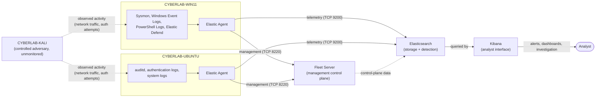
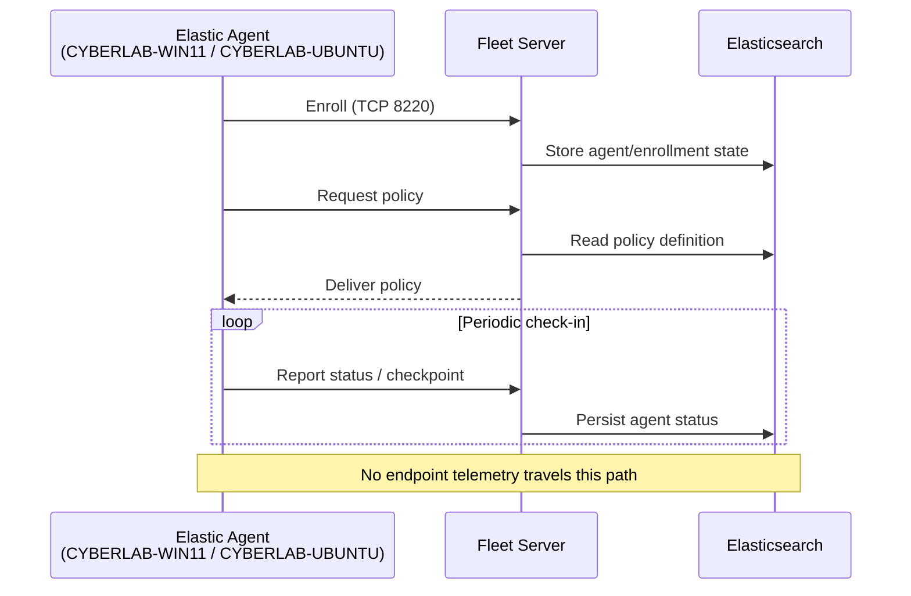
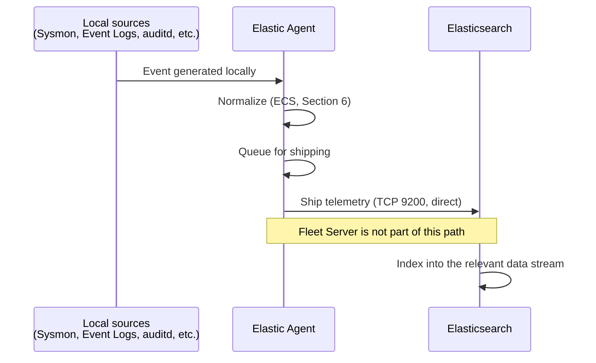
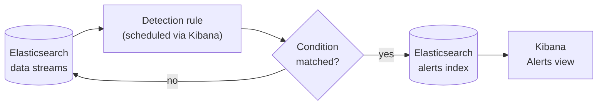
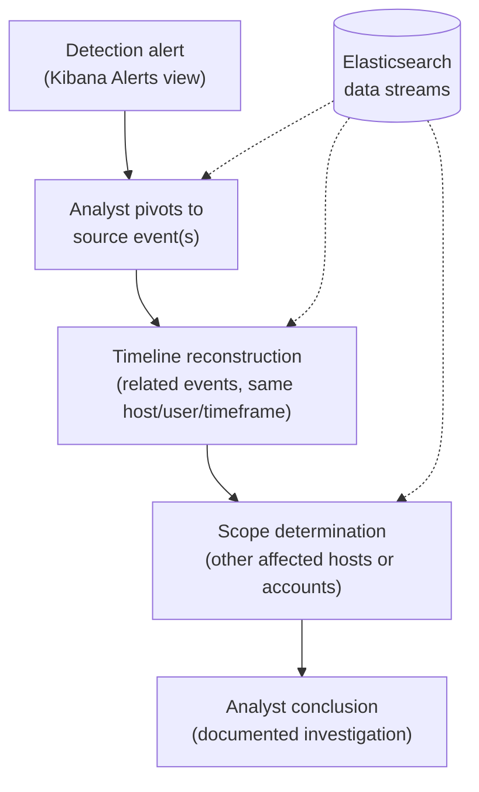

# Data Flow

## 1. Purpose

This document describes how security telemetry is planned to move through the Home SIEM lab: from the moment an event occurs on a monitored endpoint, through collection and shipping, into storage, through detection logic, and finally into an analyst's investigation in Kibana. It complements the network design in `02-network-topology.md`, the VM specifications in `03-vm-specifications.md`, and the container architecture in `04-docker-architecture.md` by describing the data, rather than the infrastructure, that moves across those layers.

This is a design document. It describes planned data flow, not a record of data that has moved through a running system.

## 2. High-Level Data Flow

At a high level, telemetry originates on the two monitored endpoints (CYBERLAB-WIN11, CYBERLAB-UBUNTU), is collected and shipped by Elastic Agent, lands in Elasticsearch, is evaluated by detection rules, and is surfaced to the analyst through Kibana. CYBERLAB-KALI intentionally represents the controlled adversary within the lab: its purpose is to generate reproducible activity that the monitored endpoints observe, not to contribute telemetry of its own (see `01-lab-overview.md` and `03-vm-specifications.md`).

Two distinct communication paths exist between an Elastic Agent and the SIEM stack, and this document treats them as separate flows throughout: a **management flow** to Fleet Server (Section 7) and a **telemetry flow** directly to Elasticsearch (Section 8). Conflating the two is a common misunderstanding of Fleet-managed deployments, so it is called out explicitly here and reflected in every diagram below.

### Diagram: Overall Telemetry Flow



## 3. Planned Data Sources

### Windows (CYBERLAB-WIN11)

| Source | Category | Telemetry |
|---|---|---|
| Sysmon | Host-based | High-fidelity process creation, network connection, driver loading, registry, image load, and file creation events |
| Windows Security Event Log | Host-based | Authentication, privilege use, account management, and object access auditing |
| Windows System Event Log | Host-based | OS-level service, driver, and system health events |
| Windows Application Event Log | Host-based | Application-level events and errors |
| Windows PowerShell Logs | Host-based | Script block logging and module logging for PowerShell activity |
| Elastic Defend | EDR | Endpoint detection and response telemetry and behavioral alerts |

### Ubuntu (CYBERLAB-UBUNTU)

| Source | Category | Telemetry |
|---|---|---|
| auditd | Host-based | Kernel-level audit events: system calls, file access, and process execution |
| Authentication logs | Host-based | SSH and local authentication activity (success, failure, privilege escalation) |
| System logs | Host-based | General system and service activity (`syslog`-family events) |

This table mirrors the telemetry sources already introduced in `01-lab-overview.md` (Section 2) and `03-vm-specifications.md` (Section 11); this document describes what happens to that data once it is generated, rather than restating why each source was chosen.

## 4. Event Generation

Events originate independently on each monitored endpoint, driven by normal OS activity and, in the lab, by deliberate test activity from CYBERLAB-KALI:

- On **CYBERLAB-WIN11**, Sysmon's kernel-level driver generates process, network, and file-system events as they occur; the native Windows Event Log service writes Security, System, and Application channel events; PowerShell's script block and module logging engine records script content and module execution; and Elastic Defend generates its own behavioral and EDR telemetry independently of Sysmon.
- On **CYBERLAB-UBUNTU**, the kernel audit subsystem generates auditd events according to configured audit rules; the authentication stack (SSH, PAM) writes authentication events; and the system logging facility records general system and service activity.

Event generation happens locally on each endpoint regardless of whether Elastic Agent, Fleet Server, or Elasticsearch is reachable — this distinction matters for the failure scenarios in Section 13, since a source can keep generating events into local logs even when nothing is available to ship them.

## 5. Collection Layer

Elastic Agent is the single collection mechanism on each monitored endpoint. It reads from the local sources listed in Section 3 (Sysmon's event channel, the Windows Event Log channels, PowerShell logs, and Elastic Defend on CYBERLAB-WIN11; auditd, authentication logs, and system logs on CYBERLAB-UBUNTU) according to the integration policies it receives from Fleet (Section 7), and queues the collected events for shipping to Elasticsearch (Section 8) after normalizing them (Section 6).

Elastic Agent is the only planned collection path in this design — no source is planned to ship directly to Elasticsearch on its own, and no separate log-forwarding tool is planned alongside it. This keeps collection centrally configurable through Fleet policy rather than through per-source configuration on each endpoint.

## 6. Data Normalization

Before shipping, Elastic Agent transforms collected telemetry into the Elastic Common Schema (ECS) wherever the source and integration support it. Raw, source-specific event formats — a Windows Event Log entry, a Sysmon event, an auditd record — are mapped onto a common set of field names and structures.

```
Raw event (source-specific format)
        ↓
Elastic Agent
        ↓
Elastic Common Schema (ECS) mapping
        ↓
Elasticsearch (Section 9)
```

Using a common schema is what allows detection rules, dashboards, timelines, and investigations (Sections 10–11) to operate consistently across Windows and Linux telemetry, rather than requiring separate logic per source and per operating system. This normalization step happens on the endpoint, before telemetry leaves it — it is part of the collection layer's work (Section 5), not something that happens later in Elasticsearch.

## 7. Management Flow

Elastic Agent's relationship with Fleet Server is a control-plane relationship, not a data-plane one. An enrolled agent uses Fleet Server for:

- **Enrollment** — establishing the agent's identity and initial policy assignment.
- **Policy retrieval** — receiving the integration policy that determines which sources it collects and how.
- **Status reporting** — reporting its own health and enrollment status back to Fleet.
- **Management actions** — receiving actions initiated from Fleet (for example, a policy change or an agent action).

No endpoint telemetry travels over this path. This is a deliberate architectural point, not an implementation detail: Fleet Server does not proxy, inspect, or forward the security events an agent collects — it manages the agent, and nothing more.

### Diagram: Management Flow



## 8. Telemetry Flow

Once configured, each Elastic Agent sends the security events it collects directly to the Elasticsearch output over TCP 9200 — this is the data-plane path, entirely separate from the management flow in Section 7. Fleet Server has no role in this path and does not sit between the agent and Elasticsearch.

### Diagram: Telemetry Flow



## 9. Storage Layer

Elasticsearch is the single storage layer for all telemetry in this design (see `04-docker-architecture.md`, Section 4). Incoming events are indexed into data streams organized by source and data type, consistent with the Elastic Common Schema normalization Elastic Agent applies during collection (Section 6). Elasticsearch also stores Fleet's own control-plane state (Section 7) and, once detection rules are active, the resulting detection alerts (Section 10).

Kibana holds no telemetry of its own. Every dashboard, alert view, and investigation screen in Kibana is a query against Elasticsearch, executed at view time. Saved objects such as dashboards, visualizations, detection rule definitions, timelines, and Fleet configuration are themselves persisted through Elasticsearch rather than in a separate telemetry datastore — Kibana's own local storage (`kibana-data`, per `04-docker-architecture.md` Section 8) is limited to Kibana's runtime state (UUID, keystore, and similar version-dependent files), not the saved objects or the security data. This matters for the failure scenarios in Section 13: Kibana being unavailable does not affect what has already been stored, only the analyst's ability to view it.

### Planned Data Stream Categories

| Data | Illustrative destination |
|---|---|
| Windows telemetry | `logs-*` |
| Ubuntu telemetry | `logs-*` |
| Elastic Defend | `logs-endpoint.*` |
| Detection alerts | `alerts-*` |

Exact data stream names are determined by each Elastic integration and are not fixed in this design document. The categories above illustrate the underlying principle: telemetry, endpoint-specific data, and detection alerts are kept in separate data streams rather than mixed into a single index.

## 10. Detection Flow

Detection rules are defined and managed through Kibana, while their execution evaluates data stored in Elasticsearch (Section 9) and writes resulting detection alerts back into Elasticsearch. Each rule defines a query or logic pattern intended to identify a specific technique or behavior, mapped to a MITRE ATT&CK technique per the goals in `01-lab-overview.md` (Sections 2 and 10). When a rule's condition matches, it generates a detection alert, which is itself written back into Elasticsearch as its own data, distinct from the raw telemetry that triggered it.

### Diagram: Detection Pipeline



Detection rule execution depends on Kibana's task scheduling being available (Section 13) — the rule logic and its scheduling live in Kibana, even though the data it queries and the alerts it produces live in Elasticsearch.

## 11. Investigation Flow

An investigation begins from a detection alert (Section 10) or from an analyst's own query in Kibana, and proceeds by pivoting from that starting point back into the raw telemetry that produced it: the specific host, process, user, or network event underlying the alert, and the surrounding events on the same host or timeframe needed to reconstruct a timeline. This mirrors the incident investigation goal from `01-lab-overview.md` (Sections 2 and 10) — moving from initial alert through timeline reconstruction, scope determination, and a final analyst conclusion.

### Diagram: Investigation Pipeline



Every step in this pipeline is a read against Elasticsearch through Kibana, against the original, unmodified telemetry — no separate investigation datastore, and no derived or summarized copy of the source events, is part of this design.

## 12. Example End-to-End Flows

### Windows PowerShell Execution

An analyst or attacker runs a PowerShell command on CYBERLAB-WIN11. PowerShell's script block logging generates an event locally (Section 4); Sysmon may also generate a corresponding process creation event for the `powershell.exe` process. Elastic Agent collects both (Section 5), normalizes them (Section 6), and ships them directly to Elasticsearch (Section 8) — Fleet Server is not involved in this path (Section 7). If a detection rule targeting suspicious PowerShell activity is defined (Section 10), it evaluates the newly indexed events on its next scheduled run and generates an alert if the pattern matches. An analyst reviewing the alert in Kibana can pivot to the underlying PowerShell script block event and the correlated Sysmon process event to reconstruct exactly what was executed (Section 11).

### Ubuntu SSH Login

A login attempt is made against CYBERLAB-UBUNTU over SSH. The authentication stack writes an authentication log event locally (Section 4), and — depending on configured audit rules — auditd may generate a corresponding event. Elastic Agent collects both (Section 5) and ships them directly to Elasticsearch (Section 8). A detection rule watching for a suspicious authentication pattern (for example, repeated failures followed by a success) evaluates the incoming events (Section 10) and generates an alert if the pattern matches. An analyst can pivot from the alert to the full sequence of authentication events for that source and account (Section 11).

### Kali-Generated Network Scan Detected by Monitored Endpoints

CYBERLAB-KALI performs a network scan against CYBERLAB-WIN11 and/or CYBERLAB-UBUNTU over VMnet1. CYBERLAB-KALI itself generates no telemetry, since it is not enrolled in Fleet (`02-network-topology.md`, `03-vm-specifications.md`) — the events that reach the SIEM originate entirely from the monitored endpoints observing the scan. On CYBERLAB-WIN11, Sysmon network connection events and/or Elastic Defend telemetry record the inbound connection attempts; on CYBERLAB-UBUNTU, auditd and/or system logs may record the resulting connection attempts or service interactions. Both endpoints' Elastic Agents ship this telemetry directly to Elasticsearch (Section 8). A detection rule watching for scan-like connection patterns (Section 10) evaluates the events and generates an alert. An analyst investigating the alert reconstructs the scan's timing and scope across both monitored endpoints from the underlying network connection events (Section 11) — CYBERLAB-KALI's own address (`192.168.72.40`) appears in this telemetry only as the observed source of the connections, not as a monitored source in its own right.

## 13. Failure Scenarios

| Component unavailable | Expected behavior |
|---|---|
| Fleet Server | Event generation and collection continue unaffected. Telemetry continues flowing directly to Elasticsearch, since Fleet Server does not sit in that path (Section 8). Agents cannot enroll, retrieve policy updates, report status, or receive management actions until Fleet Server returns; an already-enrolled, already-configured agent keeps operating on its last known policy. |
| Elasticsearch | Event generation continues unaffected. Elastic Agent provides local buffering intended to absorb temporary output interruptions, and retries shipping until Elasticsearch becomes reachable again. Buffer capacity is finite, however, and must not be treated as a substitute for a highly available Elasticsearch deployment — sustained unavailability risks event loss once local buffering is exhausted. Fleet Server's own control-plane operations degrade, since it depends on Elasticsearch (`04-docker-architecture.md`, Section 5). Kibana cannot serve dashboards, alerts, or queries, since it holds no telemetry of its own (Section 9). Detection rules cannot evaluate new data. |
| Kibana | Event generation, collection, and telemetry shipping to Elasticsearch all continue unaffected, since none of them depend on Kibana. Scheduled detection rule execution pauses, since rule scheduling runs through Kibana (Section 10) — raw telemetry continues accumulating in Elasticsearch during the outage, but rules only evaluate the gap once Kibana returns, and only within each rule's configured lookback window, so a long outage risks a detection gap even though the underlying data is preserved. The analyst cannot view dashboards, alerts, or run investigations until Kibana returns. |
| Elastic Agent (on a monitored endpoint) | Local sources (Sysmon, Windows Event Logs, PowerShell logs, Elastic Defend, auditd, authentication logs, system logs) continue writing to their own local logs, since event generation does not depend on the agent (Section 4). No collection or shipping occurs while the agent is down, and no detection rule can see that endpoint's activity during the gap. When the agent resumes, it can ship any backlog still present in the local logs, subject to each source's own local retention; any data that rotated out of local logs before the agent recovered is not recoverable. |

## 14. Validation Criteria

The following are planned checks intended to confirm the flow described in this document actually holds, end to end, once the environment exists:

- A test event generated on CYBERLAB-WIN11 (e.g., a Sysmon-visible process execution) is observable in the corresponding Elasticsearch data stream.
- A test event generated on CYBERLAB-UBUNTU (e.g., an auditd-visible file access) is observable in the corresponding Elasticsearch data stream.
- Fleet's own view shows both agents as enrolled and healthy, independent of whether telemetry is flowing (validating that management and telemetry are genuinely separate paths, per Sections 7–8).
- A detection rule targeting a known, reproducible test condition generates a corresponding alert in Kibana within its expected evaluation interval.
- An analyst can pivot from a generated alert back to its underlying raw event(s) in Kibana, confirming the investigation pipeline (Section 11) functions end to end.
- A CYBERLAB-KALI-originated action against a monitored endpoint (per the example flow in Section 12) is visible in that endpoint's telemetry and, where a relevant detection rule exists, produces an alert.
- Disconnecting Fleet Server (while Elasticsearch remains available) does not interrupt already-flowing telemetry, confirming the failure behavior in Section 13.
- Stopping Kibana does not interrupt telemetry collection or storage, and previously buffered data becomes queryable again once Kibana returns, confirming the failure behavior in Section 13.

These validation steps extend the connectivity and service validation already defined in `02-network-topology.md` (Section 10) and `04-docker-architecture.md` (Section 17), applying them specifically to the data itself rather than to network reachability or container health.

## 15. Future Expansion

The data flow described here is scoped to the current two-endpoint lab. As the future projects introduced in `01-lab-overview.md` are implemented, this flow is expected to extend along the same pattern rather than be redesigned:

- **Active Directory Attack and Defend Lab** — additional Windows telemetry sources (domain controller security event logs, authentication and directory-service events) flowing through the same Elastic Agent → Elasticsearch path, enrolled through the same Fleet Server.
- **Automated CVE Scanner** — scan results correlated into Elasticsearch as an additional data source, enabling detection rules or dashboards that combine vulnerability data with observed telemetry.
- **SOAR Automation** — response actions triggered from detection alerts (Section 10), extending the detection flow with an automated action step after alert generation rather than changing how telemetry reaches Elasticsearch.
- **Honeypot Dashboard** — a decoy-service telemetry source feeding the same Elasticsearch instance and visualized through additional dashboards, following the same collection-to-storage-to-visualization pattern described in this document.

## 16. Design Principles

The planned telemetry pipeline follows five architectural principles, each already established in the sections above:

- **Single collection mechanism** — Elastic Agent is the only planned collection path on every monitored endpoint (Section 5).
- **Separate management and telemetry paths** — Fleet Server manages agents; it never carries endpoint telemetry (Sections 7–8).
- **Centralized storage** — Elasticsearch is the single datastore for telemetry, Fleet state, and detection alerts; Kibana holds no telemetry of its own (Section 9).
- **Detection without modifying raw telemetry** — detection rules read source events and write alerts as separate data, never altering the events that triggered them (Section 10).
- **Investigation driven from immutable source events** — every investigation step is a read against the original, unmodified telemetry in Elasticsearch, not a derived or summarized copy (Section 11).
