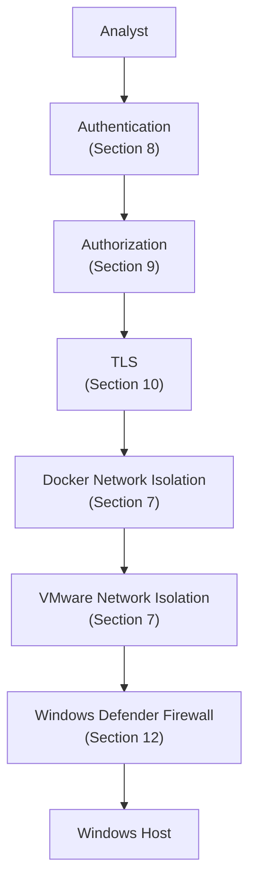
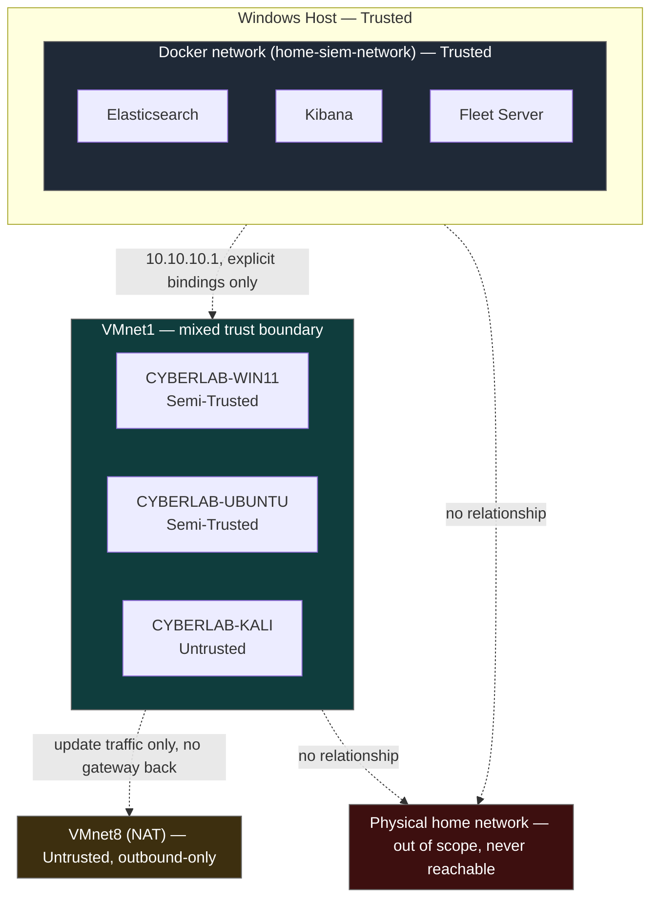
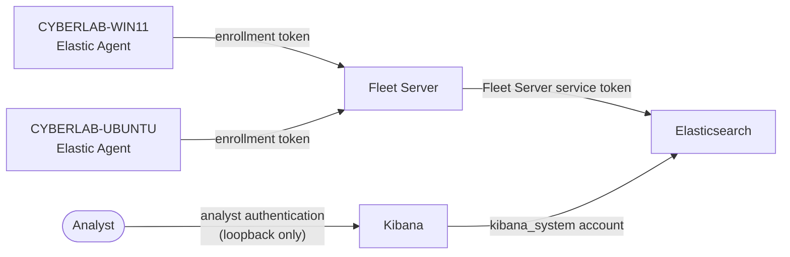
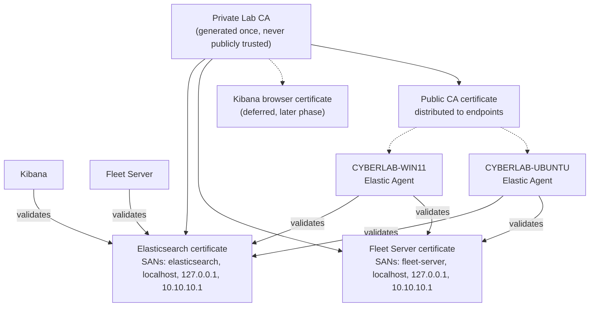

# Security Architecture

## 1. Purpose

This document defines the security architecture and trust model of the Home SIEM lab: the trust placed in each component, the boundaries between them, how authentication and authorization are planned to work, how certificates and secrets are handled, and the threat scenarios this design is intended to withstand. It draws together the security-relevant decisions already made in `02-network-topology.md`, `03-vm-specifications.md`, `04-docker-architecture.md`, and `05-data-flow.md`, and states the reasoning behind them explicitly, in one place, as a security document rather than as scattered notes across infrastructure documents.

This is a design document. It describes an intended trust model and intended controls, not a security posture that has been implemented or tested. No control described here has been verified against a running system.

## 2. Security Objectives

| Objective | Description |
|---|---|
| Confidentiality of telemetry and secrets | Collected security telemetry, credentials, tokens, and private key material are readable only by the components that legitimately need them |
| Integrity of detection data | Raw telemetry and the detection alerts derived from it are not modifiable by unauthorized parties, and detection logic operates on unaltered source events (`05-data-flow.md`, Section 16) |
| Segmented network exposure | Each service is reachable only from the specific network segment and address that its role requires, never more broadly than necessary |
| Least-privilege access | Every account, service token, and certificate carries the minimum privilege needed for its specific role, not broad or shared access |
| Defense in depth | No single control is treated as sufficient on its own; network isolation, host firewalling, explicit bindings, and TLS are layered together |
| Reproducible, auditable security posture | The security configuration is intended to be defined in version-controlled design and configuration, not accumulated through undocumented manual changes |
| Containment of the adversary role | CYBERLAB-KALI's activity is confined to a segment and posture that cannot escalate into control over the SIEM stack itself |

## 3. Security Principles

- **Least privilege** — every credential, token, certificate, and network path is scoped to the narrowest role that needs it (Sections 8–11).
- **Defense in depth** — security properties are never assumed from a single control; Docker host bindings, Windows Defender Firewall, VMware network isolation, and TLS are designed to overlap rather than substitute for each other (`04-docker-architecture.md`, Section 15).
- **Explicit trust boundaries** — every boundary in this lab (Windows host / VMnet1, VMnet1 / VMnet8, Docker network / VMware networks, monitored endpoints / CYBERLAB-KALI) is drawn deliberately and documented, not left implicit (Sections 5–7).
- **No implicit trust between segments** — reachability across a boundary is never assumed; each boundary is enforced by a specific, named control.
- **Secrets never enter version control** — no credential, token, or private key is committed to the repository, under any circumstance (Section 11).
- **Full verification over convenience** — TLS certificate verification is never bypassed as a standing configuration, even temporarily, without it being an explicit, logged exception (Section 10).
- **Fail toward containment** — where a component's availability and its security posture conflict, this design favors the choice that keeps the compromise of one component from extending to others (Section 13).

### Diagram: Security Layers (Defense in Depth)



Each layer in this diagram is designed to hold even if the layer above it fails — an analyst request still passes through authorization after authentication, still travels over TLS after authorization, and so on down to the host firewall and the host itself. No layer is intended to compensate for a missing layer beneath it; this ordering is the practical expression of the defense-in-depth principle above.

## 4. Assets

Before assigning trust levels or describing controls, this design starts from what it is actually protecting:

| Asset | Protection goal |
|---|---|
| Telemetry (Windows and Ubuntu source data) | Integrity |
| Detection rules | Integrity |
| Detection alerts | Integrity |
| Credentials (passwords, tokens) | Confidentiality |
| Certificates and private keys | Confidentiality |
| Docker images | Integrity |
| Configuration (Fleet policies, service configuration) | Integrity |

Availability is treated as a secondary goal throughout this design, addressed through the failure and recovery behavior already defined in `04-docker-architecture.md` (Section 13) and `05-data-flow.md` (Section 13), rather than as a primary security objective in its own right — this is a home lab, not a production system with uptime commitments. Confidentiality and integrity of the assets above are what the trust model, controls, and threat scenarios in the remainder of this document are built around.

## 5. Trust Model

Each component in the lab is assigned one of three trust levels — **Trusted**, **Semi-Trusted**, or **Untrusted** — based on what it holds, what it can affect, and how exposed it is. A single consistent scale is used throughout, rather than intermediate gradations, so that any future component (for example, a domain controller added under `01-lab-overview.md`, Section 8) can be placed unambiguously: infrastructure the lab depends on is Trusted, a managed endpoint that is also a deliberate attack target is Semi-Trusted, and an adversarial or unmanaged host is Untrusted.

| Component | Trust level | Rationale |
|---|---|---|
| Windows host | Trusted | Controls Docker Desktop, VMware Workstation Pro, the host firewall, and the VMnet1 gateway address (`10.10.10.1`); compromise of the host compromises everything else in the lab, making it the single most critical asset even though Elasticsearch holds the most valuable data (Section 6) |
| Docker network (`home-siem-network`) | Trusted | Hosts the entire SIEM backend (Elasticsearch, Kibana, Fleet Server); isolated from both VMware networks (`04-docker-architecture.md`, Section 6) |
| Elasticsearch | Trusted | Holds all collected telemetry, Fleet state, and detection alerts — the lab's most sensitive data store |
| Kibana | Trusted | Provides full analyst access to Elasticsearch's data and Fleet management; restricted to host localhost specifically because of this trust level (Section 7) |
| Fleet Server | Trusted | Acts as the management control plane for every enrolled agent; the most exposed of the lab's trusted infrastructure components, since monitored endpoints must reach it directly over VMnet1 |
| Windows endpoint (CYBERLAB-WIN11) | Semi-Trusted | A managed, Fleet-enrolled asset that is also a deliberate target for simulated attacks; trusted enough to hold agent credentials, but treated as a potential compromise target, not as trusted infrastructure |
| Ubuntu endpoint (CYBERLAB-UBUNTU) | Semi-Trusted | Same rationale as the Windows endpoint |
| Kali attacker VM (CYBERLAB-KALI) | Untrusted | Deliberately adversarial by design; holds no lab credentials, no enrollment, and no trust relationship with any other component (`02-network-topology.md`, Section 9; `03-vm-specifications.md`, Section 6) |

### Diagram: Trust Boundaries



The Windows host boundary and the VMnet1 boundary are bridged only through the explicit, narrow set of host port bindings defined in `04-docker-architecture.md` (Section 7) — the boundary is not "open," it has three specific, documented holes in it. CYBERLAB-KALI sits inside the VMnet1 boundary physically (it shares the segment) but is deliberately excluded from every trust relationship that crosses it (Section 7).

## 6. Attack Surface

### Exposed Services

| Service | Binding | Reachable from | Role in attack surface |
|---|---|---|---|
| Elasticsearch | `10.10.10.1:9200` | VMnet1 (`10.10.10.0/24`) | Highest-value data asset within the laboratory; reachable by any host on VMnet1, including a compromised endpoint |
| Fleet Server | `10.10.10.1:8220` | VMnet1 (`10.10.10.0/24`) | Management control-plane target — compromise could allow rogue enrollment or malicious policy delivery |
| Kibana | `127.0.0.1:5601` | Host loopback only | Full analyst access surface, deliberately kept off every network segment |

No other lab service is intentionally exposed. Elasticsearch's transport port (9300) is never published (`04-docker-architecture.md`, Sections 7 and 15), and no lab service is bound to the host's physical network interface under any planned configuration.

Elasticsearch is the lab's highest-value *data* asset, but not necessarily its most critical *component* overall — that distinction belongs to the Windows host (Section 5), since a compromise there cascades into every other component, including Elasticsearch itself. The lab's practical network attack surface is concentrated in two places: the two published VMnet1 ports (Elasticsearch, Fleet Server), reachable by anything on that segment including a compromised monitored endpoint or CYBERLAB-KALI itself; and the Windows host's own local surface (Docker Desktop, WSL2, VMware Workstation Pro), which this design treats as already trusted (Section 14) rather than as something the lab's controls defend against.

## 7. Network Segmentation

Network segmentation is the lab's primary structural control, and each exposure decision below is deliberate:

- **Kibana is localhost-only** because it is the highest-trust interface in the lab — full analyst access to every piece of collected telemetry and to Fleet management. Restricting it to the host's own loopback interface means no VM, including a compromised monitored endpoint, can reach it at all, regardless of any credential it might obtain.
- **Elasticsearch is VMnet1-only** because monitored endpoints must reach it directly for telemetry (`05-data-flow.md`, Section 8), but nothing outside the lab's internal segment has any legitimate reason to. Scoping it to VMnet1 keeps that necessary exposure bounded to exactly the segment that needs it.
- **Fleet Server is VMnet1-only** for the same reason — enrollment, policy retrieval, and status reporting are needed only by monitored endpoints on VMnet1, so its exposure is scoped identically to Elasticsearch's, not more broadly.
- **Docker networking is isolated from VMware networking** (`04-docker-architecture.md`, Section 6) because the two serve different purposes and mixing them would erode the segmentation this design relies on: `home-siem-network` is where the SIEM backend trusts its own containers by service name, while VMnet1 is where the lab's Semi-Trusted and Untrusted hosts live. Bridging them directly, rather than through the three explicit host bindings in Section 6, would let any VMnet1 host address Docker-internal service names and defeat the purpose of the separation.

### Diagram: Network Trust Zones

```mermaid
flowchart LR
    subgraph Z1["Zone: Physical home network — Untrusted, excluded"]
    end
    subgraph Z2["Zone: VMnet8 (NAT) — Untrusted, outbound-only"]
    end
    subgraph Z3["Zone: VMnet1 — mixed trust, internal lab segment"]
        direction TB
        Z3A["Monitored endpoints\n(Semi-Trusted)"]
        Z3B["CYBERLAB-KALI\n(Untrusted, co-located)"]
    end
    subgraph Z4["Zone: Docker network — Trusted, SIEM backend"]
    end
    subgraph Z5["Zone: Host loopback — Trusted, analyst only"]
    end

    Z3 -- "TCP 8220, 9200 only" --> Z4
    Z3 -- "update traffic only" --> Z2
    Z5 -.-> Z4
    Z1 -.-> Z1

    style Z1 fill:#3d0f0f,color:#fff,stroke:#666
    style Z2 fill:#3d2f0f,color:#fff,stroke:#666
    style Z3 fill:#0f3d3d,color:#fff,stroke:#666
    style Z4 fill:#1f2937,color:#fff,stroke:#666
    style Z5 fill:#1f2937,color:#fff,stroke:#666
```

## 8. Authentication Model

Four distinct authentication mechanisms are planned, each scoped to a specific relationship rather than shared across roles:

- **Enrollment Tokens** authenticate an individual Elastic Agent (on CYBERLAB-WIN11 or CYBERLAB-UBUNTU) to Fleet Server at enrollment time, and are typically scoped to a specific Fleet policy. They establish an agent's identity, not Fleet Server's own access to Elasticsearch.
- **Fleet Server Service Token** authenticates Fleet Server itself to Elasticsearch, so it can operate as the management control plane. This is distinct from, and not interchangeable with, an enrollment token (`04-docker-architecture.md`, Section 10).
- **`kibana_system`** is the built-in service account Kibana uses to authenticate to Elasticsearch on its own behalf — for reading and writing saved objects, querying data, and managing Fleet through the Elasticsearch APIs it depends on. It is a service identity, not an analyst identity.
- **Analyst authentication** governs the human accessing Kibana itself, from the host's browser, over the loopback-only binding (Section 7). This is the only credential in the model intended for direct human use; every other mechanism here authenticates a service to another service.

### Authentication Relationships

| Relationship | Mechanism | Scope |
|---|---|---|
| Elastic Agent → Fleet Server | Enrollment token | Per-agent identity, scoped to a Fleet policy |
| Fleet Server → Elasticsearch | Fleet Server service token | Fleet Server's own access, for control-plane operations |
| Kibana → Elasticsearch | `kibana_system` account | Kibana's own access, for saved objects, queries, and Fleet management |
| Analyst → Kibana | Analyst authentication | Human access, local to the host, over loopback only |

### Diagram: Authentication Relationships



No mechanism in this model is designed to be reused across relationships — an enrollment token cannot substitute for the Fleet Server service token, and `kibana_system` is not an analyst credential. Keeping these separate limits what any single leaked credential can do (Section 13).

## 9. Authorization Model

Authorization is planned to layer on top of the authentication model in Section 8, narrowing what an authenticated identity can actually do:

- **`kibana_system`** is a built-in, purpose-limited role — it is authorized for the operations Kibana itself needs (saved objects, index access for its own use, Fleet-related APIs), not for unrestricted administrative access to Elasticsearch.
- **The Fleet Server service token's** associated privileges are scoped to Fleet-related indices and control-plane operations, not to the full breadth of telemetry data Elasticsearch holds.
- **Analyst access in Kibana** is intended to use a role appropriate to the analyst's actual work (viewing telemetry, managing detection rules, investigating alerts) rather than the Elastic superuser account for routine use — the superuser identity is reserved for initial setup and administrative tasks, not day-to-day analysis.
- **Elastic Agent policies**, delivered through Fleet, scope what each agent collects and how — an agent's policy is itself an authorization boundary, determining which integrations and data sources are active on a given endpoint.

### Authorized Actions by Identity

| Identity | Authorized actions |
|---|---|
| Elastic Agent | Ship telemetry to Elasticsearch; report status and receive policy from Fleet Server |
| Fleet Server | Manage agent enrollment, policy delivery, and status; access Fleet-related indices in Elasticsearch |
| Kibana (`kibana_system`) | Query Elasticsearch; read and write saved objects; manage Fleet through Elasticsearch APIs |
| Analyst | Investigate telemetry and alerts; manage detection rules and dashboards, within Kibana |
| Superuser | Initial setup and administrative tasks only — not used for routine analysis |

This lab does not plan a multi-analyst role hierarchy, since it is designed around a single analyst (Section 14); the authorization boundaries above exist to separate service identities from each other and from the analyst, not to arbitrate between multiple human users.

## 10. Certificate Trust Model

The lab's TLS trust is rooted in a single private lab certificate authority, generated once and never intended to be publicly trusted (`04-docker-architecture.md`, Section 9). Every service certificate in the lab is issued by this CA, and every client is expected to validate against it — full certificate verification, with no permanent use of insecure-verification flags.

- Elasticsearch's HTTP certificate and Fleet Server's certificate each carry both a Docker service-name SAN and the VMnet1 address `10.10.10.1`, because each must validate for two different classes of client: internal Docker clients using service names, and external VM clients using the VMnet1 address (`04-docker-architecture.md`, Section 9).
- The public CA certificate is planned to be distributed to CYBERLAB-WIN11 and CYBERLAB-UBUNTU specifically, so each endpoint's Elastic Agent can validate the certificates it receives from Elasticsearch and Fleet Server. CYBERLAB-KALI is deliberately excluded from this distribution — it has no legitimate reason to validate, or be trusted by, any lab service (Section 5).
- A Kibana browser-facing certificate is deferred to a later phase, consistent with Kibana's current loopback-only exposure (Section 7); the trust model already anticipates it, but the reduced urgency reflects the reduced exposure.

### Diagram: Certificate Trust Chain



## 11. Secrets Management

Secrets handling follows the design already established in `04-docker-architecture.md` (Section 10):

- An `.env.example` file with placeholder values only is planned for version control; the real `.env` file is excluded from Git entirely.
- Elastic superuser and `kibana_system` passwords, the Fleet Server service token, Elastic Agent enrollment tokens, API keys, private certificate keys, generated password files, and private CA material are all classified as never-committed secrets.
- Enrollment tokens and the Fleet Server service token are treated as distinct concerns with distinct scopes (Section 8), not interchangeable values that happen to look similar.
- Private key material follows the per-service certificate volume design in `04-docker-architecture.md` (Section 8) — no service holds a private key it does not need, and no single shared location grants every service read access to every key.

This document does not restate the secrets classification table itself; it is authoritative in `04-docker-architecture.md`, Section 10, and this section exists to confirm that secrets handling is treated as a security control, not merely an operational convenience.

## 12. Security Controls

| Control | Layer | Purpose |
|---|---|---|
| Private lab CA and TLS with full certificate validation | Communication | Confidentiality and authenticity of Elastic Agent, Fleet Server, and Elasticsearch communication (Section 10) |
| Explicit host interface bindings (`10.10.10.1` / `127.0.0.1`) | Network | Prevents Docker's default all-interfaces publishing from exposing services beyond their intended segment (`04-docker-architecture.md`, Section 7) |
| Windows Defender Firewall rules | Network | Defense-in-depth filtering, independent of Docker's own bindings (`02-network-topology.md`, Section 8) |
| Docker bridge network isolation (`home-siem-network`) | Network | Keeps inter-container communication separate from both VMware networks (Section 7) |
| VMware host-only network isolation (VMnet1, no bridged adapters) | Network | Keeps the lab's internal traffic off the physical home network entirely (`02-network-topology.md`, Section 9) |
| Named volumes for service-owned state | Storage | Keeps Elasticsearch data and certificates out of ad hoc host filesystem locations, under Docker's access control (`04-docker-architecture.md`, Section 8) |
| Git exclusion for secrets (`.env`, private keys) | Repository | Prevents accidental disclosure of credentials and key material through version control (Section 11) |
| Least-privilege service accounts and tokens | Identity | Limits what any one compromised credential can access (Sections 8–9) |
| No privileged containers, no Docker socket mount | Runtime | Limits what a compromised container can do to the host or to other containers (`04-docker-architecture.md`, Section 15) |
| No `latest` image tags | Supply chain | Ensures every deployment uses a deliberately chosen, known Elastic Stack version rather than an unpredictable moving target (`04-docker-architecture.md`, Section 16) |
| CYBERLAB-KALI excluded from Fleet enrollment and CA distribution | Identity | Ensures the adversary-role host holds no credential or trust relationship that could be abused (Sections 5, 10) |

## 13. Threat Scenarios

| Scenario | Description | Planned mitigation |
|---|---|---|
| Credential exposure | A secret (password, token, or private key) is accidentally committed to the repository or logged in plaintext | Git exclusion of `.env` and key material (Section 11); `.env.example` contains placeholders only; least-privilege scoping limits the blast radius of any one exposed credential (Sections 8–9) |
| Unauthorized endpoint enrollment | An unintended or malicious host attempts to enroll as an Elastic Agent against Fleet Server | Fleet Server is reachable only from VMnet1 (Section 6); enrollment requires a valid, scoped enrollment token (Section 8), which is itself a never-committed secret (Section 11) |
| Man-in-the-middle (MITM) attempts | An attacker on VMnet1 attempts to intercept or impersonate Elasticsearch, Fleet Server, or Kibana traffic | Full TLS certificate validation against the private lab CA (Section 10) is designed to make impersonation significantly more difficult without compromising the lab certificate authority itself; no permanent insecure-verification bypass exists in this design |
| Excessive network exposure | A misconfiguration exposes Elasticsearch, Fleet Server, or Kibana beyond their intended segment (e.g., to the physical home network or all host interfaces) | Explicit Docker host bindings plus Windows Defender Firewall rules, layered together (Section 12); Kibana's loopback-only binding removes it from network exposure entirely regardless of firewall state |
| Container compromise | An attacker who gains code execution inside one SIEM container (e.g., via a vulnerable dependency) attempts to pivot to other containers, the host, or stored data | No privileged containers and no Docker socket mount limit host pivot potential (`04-docker-architecture.md`, Section 15); per-service certificate volumes limit what key material is reachable from within a single compromised container (Section 10); named-volume data separation limits direct access to other services' state |
| Accidental secret disclosure | A secret is unintentionally shared — for example, through a screenshot, log output, or a misconfigured environment variable dump | Secrets are excluded from version control and scoped to the minimum needed per service (Sections 8, 11); this design also avoids embedding secrets in this documentation set at all, so no secret value exists in the docs for the lab's own writeups to leak |

## 14. Security Assumptions

This design rests on the following assumptions, which are stated explicitly because the controls above do not defend against their violation:

- The Windows host itself is not already compromised; the host is treated as trusted infrastructure, not as part of the lab's attack surface (Section 6).
- Docker Desktop, WSL2, and VMware Workstation Pro are trusted platform components, not adversarial.
- The lab operates in a single-analyst model; no multi-user access control hierarchy is designed for Kibana or Elasticsearch beyond the service/analyst separation in Section 9.
- The physical environment hosting the lab (the home network and the physical machine) has reasonable physical security; this design addresses network and application-layer trust, not physical access control.
- CYBERLAB-KALI is operated in a controlled, intentional manner by the lab's own analyst — its untrusted classification (Section 5) reflects its architectural role, not an assumption that it is compromised or operated by an unknown party.
- No lab service is expected to be reachable from outside VMnet1, VMnet8 (outbound only), or host loopback, per the network design in `02-network-topology.md`; this document assumes that design holds and does not re-derive it.

## 15. Validation Criteria

The following validation steps are planned to confirm the security architecture described in this document actually holds, once the environment exists. None of these have been performed yet.

- Kibana is reachable only via `127.0.0.1:5601`, and unreachable from VMnet1, VMnet8, and the physical home network (extends `04-docker-architecture.md`, Section 17).
- Elasticsearch and Fleet Server are reachable from VMnet1 only, via their designated `10.10.10.1` bindings, and unreachable from VMnet8, the physical home network, or port 9300.
- A connection to Elasticsearch or Fleet Server using a certificate not issued by the lab CA fails validation, confirming full certificate verification is enforced rather than assumed.
- An enrollment attempt against Fleet Server without a valid enrollment token is rejected.
- The Fleet Server service token and an Elastic Agent enrollment token are confirmed to be different values with different scopes, not the same credential reused (Section 8).
- No `.env` file, private key, password, or token is present in Git history or the tracked working tree (Section 11).
- `kibana_system` and the Fleet Server service token are confirmed to operate under limited, role-appropriate privileges rather than superuser access (Section 9).
- CYBERLAB-KALI is confirmed to hold no enrollment token, no service token, and no copy of the lab CA's trust material (Sections 5, 10).
- A review of running containers confirms none run privileged and none mount the Docker socket (Section 12).
- A review of published ports confirms no service is bound to the host's physical network interface.

These criteria extend, and are intended to be run alongside, the connectivity and service validation already defined in `02-network-topology.md` (Section 10), `04-docker-architecture.md` (Section 17), and `05-data-flow.md` (Section 14) — this document adds the security-specific checks that those validation plans do not already cover.

## 16. Future Improvements

The current design intentionally leaves some security capabilities for later phases, consistent with the lab's incremental build-out (`01-lab-overview.md`, Section 8):

- **Mutual TLS** between Elastic Agents and Elasticsearch/Fleet Server, beyond the one-way TLS model in Section 10.
- **A browser-trusted Kibana certificate**, once Kibana's exposure extends beyond host loopback.
- **A dedicated secrets management mechanism** (such as a vault-style tool) in place of `.env`-file-based secrets, if the lab's scope grows beyond what file-based exclusion comfortably supports.
- **Finer-grained Kibana role definitions**, if the lab moves beyond a single-analyst model.
- **Formal threat modeling using a structured methodology** (such as STRIDE) may be introduced as the lab expands to additional services — the threat scenarios in Section 13 are treated as a starting point, not a final, exhaustive analysis.
- **Extending this trust model to future projects** — the Active Directory Attack and Defend Lab, Automated CVE Scanner, SOAR Automation, and Honeypot Dashboard (`01-lab-overview.md`, Section 8) will each need their own trust-level assignment and threat scenarios added to this document rather than assumed to inherit the current model unchanged.
