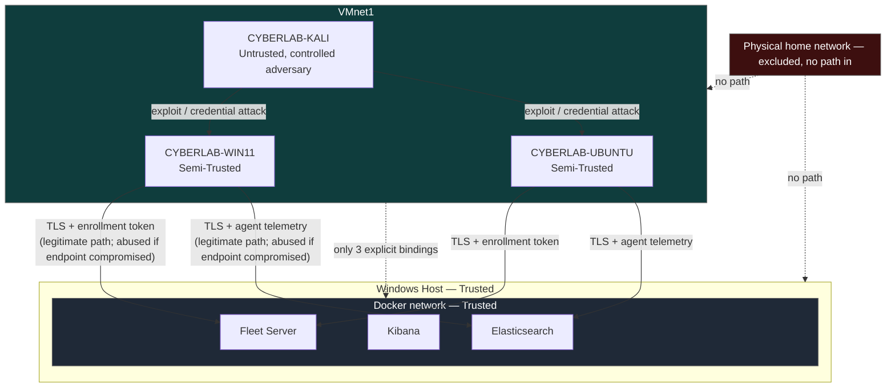
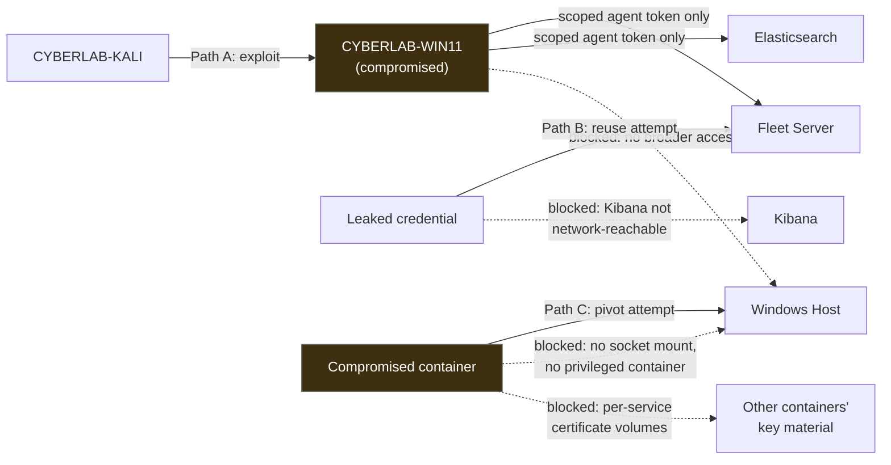
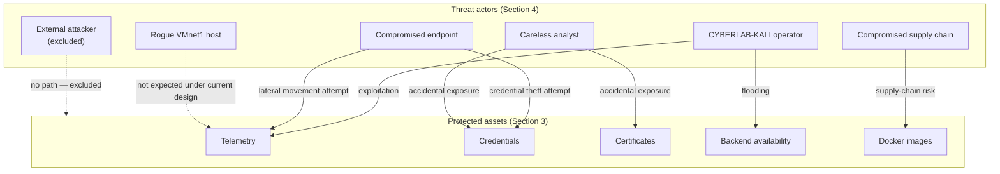

# Threat Model

## 1. Purpose

This document defines the planned threat model for the Home SIEM lab: who might act against it, what they could target, how they could reach it, and what is planned to stand in their way. It builds directly on the trust model and controls already established in `06-security-architecture.md`, but shifts the lens from "what controls exist" to "what is this lab actually defending against, and how well."

This is a design document. It describes a planned threat model, not a completed risk assessment of a running system. No scenario described here has been tested against a live deployment.

This lab intentionally takes an **architectural risk** approach rather than a software-vulnerability approach. Software vulnerabilities in the Elastic Stack, the guest operating systems, or any third-party dependency change continuously and are addressed through ongoing patching and version discipline — a moving target better suited to the lab's own planned **Automated CVE Scanner** project (`01-lab-overview.md`, Section 8) than to a static design document. What a design document *can* fix, and what this one focuses on, is the lab's architecture: where trust boundaries sit, how narrowly each credential is scoped, how far a compromise in one place can spread before something stops it. Those properties are decided once, at design time, and hold regardless of which specific software version is running — which is exactly why they are the subject of a threat model, while specific vulnerabilities are the subject of an operational process.

## 2. Scope

**In scope:** trust boundaries and network segmentation (`02-network-topology.md`), authentication and authorization design (`06-security-architecture.md`, Sections 8–9), certificate and secrets handling (`06-security-architecture.md`, Sections 10–11), container and VM isolation (`03-vm-specifications.md`, `04-docker-architecture.md`), and the realistic ways a threat actor operating within or adjacent to this lab could act against it.

**Out of scope:** specific CVEs or known vulnerabilities in any product version, vulnerability scanning or patch scheduling (reserved for the future Automated CVE Scanner project), physical security controls beyond the assumptions stated in Section 11, and any consideration of multi-tenant or production compliance requirements — this is a single-analyst home lab, not a production environment being modeled for production risk (`01-lab-overview.md`, Section 9).

## 3. Protected Assets

| Asset | Why it matters |
|---|---|
| Telemetry (Windows and Ubuntu source data) | The lab's entire value as a SIEM depends on this data being complete and unaltered |
| Detection rules and their MITRE ATT&CK mappings | Represent the analyst's detection engineering work; tampering would silently blind the lab |
| Detection alerts | Must reflect genuine rule matches against genuine telemetry to be trustworthy for investigation |
| Credentials (passwords, tokens) | Direct path to impersonating a trusted service or the analyst |
| Certificates and private keys | Root of the lab's TLS trust; compromise undermines every other control that depends on TLS |
| Docker images | Supply-chain integrity of the SIEM backend itself |
| Configuration (Fleet policies, service configuration) | Determines what is collected and how the stack behaves; silent tampering here is as damaging as tampering with the data itself |
| Availability of the SIEM platform | A secondary goal (`06-security-architecture.md`, Section 4) — valuable, but explicitly not defended to production-availability standards in this lab |

## 4. Threat Actors

| Threat actor | Capability | Motivation / role in the lab | In scope |
|---|---|---|---|
| CYBERLAB-KALI operator | Full offensive tooling (Nmap, NetExec, Impacket, Responder), network-adjacent on VMnet1 | The lab's own controlled adversary, used deliberately to generate detectable activity (`03-vm-specifications.md`, Section 6) | Yes — this is the primary, intended actor this lab is built to observe |
| A compromised monitored endpoint | Whatever access an attacker gains after successfully compromising CYBERLAB-WIN11 or CYBERLAB-UBUNTU | Represents the "what happens next" case once the Kali operator succeeds against an endpoint — post-exploitation, pivoting, credential theft | Yes |
| A rogue or unexpected host on VMnet1 | Network-adjacent, but without a legitimate role in the lab | A hypothetical unmanaged device reachable on the internal segment; represents configuration drift or an unplanned addition to the lab | Yes, as a scenario; not expected to actually occur under the network design in `02-network-topology.md` |
| The analyst, acting carelessly (not maliciously) | Full legitimate access to the host, Kibana, and the repository | Human error: accidental secret commits, misconfiguration, careless documentation | Yes — this is a realistic and, in a solo home lab, arguably the most likely actor of all |
| Compromised supply chain (container image or dependency) | Whatever the compromised image or package is capable of, from within its container | Represents risk introduced through the images and dependencies the stack is built from, rather than through direct attacker action | Yes, as an architectural consideration (Section 7); specific image vulnerabilities are out of scope (Section 2) |
| External attacker via the physical home network or internet | Would require reaching a lab service from outside VMnet1/VMnet8 | Named here specifically to state that this actor is excluded by design | Out of scope by design — no lab service is bound to a physical or internet-reachable interface (`06-security-architecture.md`, Section 6) |

## 5. Attack Surface

The lab's attack surface is deliberately small and is inherited directly from `06-security-architecture.md` (Section 6):

- **Elasticsearch** (`192.168.72.1:9200`) and **Fleet Server** (`192.168.72.1:8220`), reachable only from VMnet1.
- **Kibana** (`127.0.0.1:5601`), reachable only from host loopback — not part of the network-facing attack surface at all.
- The **monitored endpoints themselves** (CYBERLAB-WIN11, CYBERLAB-UBUNTU), which are attack surface in the ordinary sense (they run services, accept connections, execute code) precisely because they are meant to be attacked by CYBERLAB-KALI as part of the lab's purpose.

Everything else is explicitly not exposed: Elasticsearch's transport port (9300), any host binding to the physical network interface, and any service on VMnet8 beyond outbound update traffic. A threat actor confined to VMnet1 — the realistic position of both CYBERLAB-KALI and a hypothetical compromised endpoint — has exactly two backend services to target and two monitored endpoints to pivot through or from.

## 6. Trust Boundaries

Every threat scenario in Section 7 is ultimately a question of whether, and how, an actor crosses one of the boundaries below. These boundaries are the same ones established in `06-security-architecture.md` (Section 5), restated here from the attacker's perspective: what would it actually take to get from one side to the other.

| Boundary | What crossing it would require |
|---|---|
| CYBERLAB-KALI → a monitored endpoint | A successful exploit or credential compromise against CYBERLAB-WIN11 or CYBERLAB-UBUNTU over VMnet1 |
| A monitored endpoint → Elasticsearch / Fleet Server | Valid TLS trust and, for Fleet Server, a valid enrollment token; the endpoint's Elastic Agent already has a legitimate path here, so this boundary matters most if the endpoint itself is compromised |
| VMnet1 → Docker network (`home-siem-network`) | Only the three explicit host bindings (Section 5); no other path exists, since the two networks are architecturally isolated (`04-docker-architecture.md`, Section 6) |
| Windows host → everything | Requires compromising the host itself, which this design treats as an assumption boundary, not a defended one (Section 11) |
| Physical home network → the lab | No path exists by design; excluded entirely (Section 4) |

### Diagram: Trust Boundaries

## 7. Threat Scenarios

| Threat | Protected asset | Threat description | Planned mitigations | Residual risk |
|---|---|---|---|---|
| Unauthorized endpoint enrollment | Configuration; telemetry integrity | An unintended or malicious host attempts to enroll as an Elastic Agent against Fleet Server, potentially injecting false telemetry or gaining a foothold in Fleet | Fleet Server reachable only from VMnet1 (Section 5); enrollment requires a valid, scoped enrollment token (`06-security-architecture.md`, Section 8), itself excluded from version control | Low — requires both VMnet1 access and a valid token, which is not distributed to CYBERLAB-KALI |
| Credential leakage | Credentials | A password, token, or private key is exposed through a committed file, log output, or careless handling | Git exclusion of `.env` and key material; `.env.example` placeholders only; least-privilege scoping limits what any one leaked credential grants (`06-security-architecture.md`, Sections 8, 11) | Medium — human error is the most realistic source of this threat and is reduced, not eliminated, by process controls |
| MITM attempts | Telemetry integrity; credentials in transit | An actor on VMnet1 attempts to intercept or impersonate Elasticsearch, Fleet Server, or Kibana traffic | Full TLS certificate validation against the private lab CA, with no permanent insecure-verification bypass (`06-security-architecture.md`, Section 10) | Low — significantly more difficult without the CA's private key, though not treated as impossible |
| Excessive service exposure | All backend assets | A misconfiguration exposes Elasticsearch, Fleet Server, or Kibana beyond VMnet1 or host loopback | Explicit Docker host bindings layered with Windows Defender Firewall rules (`06-security-architecture.md`, Section 12) | Low-Medium — layered, but a configuration error during iterative changes to the stack remains plausible |
| Compromised monitored endpoint | Endpoint integrity; lateral-movement containment | CYBERLAB-KALI (or a real attacker in the same position) successfully compromises CYBERLAB-WIN11 or CYBERLAB-UBUNTU | This is the lab's intended exercise scenario, not a failure state on its own; containment relies on network segmentation and least-privilege agent credentials to keep the compromise from extending to Elasticsearch, Fleet Server, or the other endpoint | Medium — accepted as the lab's core function; the residual concern is lateral movement beyond the single compromised endpoint, which segmentation and scoped credentials are designed to limit |
| Container compromise | Docker images; backend data | Code execution is gained inside a SIEM container (`elasticsearch`, `kibana`, or `fleet-server`) through a vulnerable dependency or misconfiguration | No privileged containers, no Docker socket mount, per-service certificate volumes, named-volume data separation (`04-docker-architecture.md`, Section 15; `06-security-architecture.md`, Section 10) | Low-Medium — host pivot is specifically constrained, but data reachable from within the compromised container itself remains at risk |
| Accidental secret disclosure | Credentials; certificates | A secret is unintentionally shared through a screenshot, log output, or documentation artifact — a real risk for a portfolio project that produces public writeups | Secrets excluded from version control and scoped per service; this documentation set itself avoids embedding any real secret value (`06-security-architecture.md`, Section 13) | Medium — depends on ongoing analyst discipline when producing public-facing material, not solely on technical controls |
| Denial of service against Elasticsearch | Availability of the SIEM platform | Elasticsearch, as a single-node lab cluster, is overwhelmed by ingestion volume, a resource-intensive query, or deliberate flooding from CYBERLAB-KALI | None planned beyond the resource allocation already sized in `04-docker-architecture.md` (Section 12); this is a home lab with no high-availability design | Accepted — availability is an explicit secondary goal (`06-security-architecture.md`, Section 4), not a defended property |
| Analyst credential compromise | Kibana access; full investigative visibility | The analyst's own Kibana credential is stolen or guessed | Kibana bound to host loopback only, so remote credential use is not possible even if the credential itself is compromised (`06-security-architecture.md`, Section 7) | Low — the network boundary meaningfully limits impact even though the host itself is an assumption boundary (Section 11) |

## 8. Representative Attack Paths

### Path A: Endpoint compromise attempting to reach the SIEM backend

CYBERLAB-KALI compromises CYBERLAB-WIN11 (the intended exercise, Section 7). From that foothold, an attacker attempts to reach Elasticsearch or Fleet Server directly, hoping the endpoint's existing network position grants broader access. The attempt is limited to what the compromised endpoint's own Elastic Agent credentials allow — an enrollment token scoped to that single agent (`06-security-architecture.md`, Section 8) — rather than any administrative access to Elasticsearch or Fleet Server itself. The path does not extend past the compromised endpoint's own telemetry-shipping and check-in privileges.

### Path B: Leaked credential reused outside the host

A secret is accidentally disclosed (Section 7, "Accidental secret disclosure" or "Credential leakage"). An attacker attempts to use it — for example, an enrollment token, hoping to enroll a rogue agent, or a `kibana_system`-style credential, hoping to query Elasticsearch directly. The enrollment path requires reaching Fleet Server on VMnet1 (Section 5); the Elasticsearch path requires the same network position. A leaked Kibana analyst credential, by contrast, is not usable at all from off-host, since Kibana is not reachable from any network segment (Section 7's Kibana row).

### Path C: Compromised container attempting host pivot

An attacker gains code execution inside one SIEM container through a vulnerable dependency (Section 7, "Container compromise"). From there, the path toward the host is blocked by the absence of a Docker socket mount and the avoidance of privileged containers (`04-docker-architecture.md`, Section 15); the path toward other containers' private key material is blocked by per-service certificate volumes (`06-security-architecture.md`, Section 10). The attacker is left with whatever data and access the single compromised container itself holds.

### Diagram: Attack Paths

### Diagram: Overall Threat Landscape

## 9. Residual Risks

Every mitigation in Section 7 reduces a risk; none eliminate one entirely. This section classifies what remains, using three explicit categories rather than a numeric score.

| Risk | Classification | Rationale |
|---|---|---|
| Unauthorized endpoint enrollment | Reduced through controls | Network scoping and token requirements make this unlikely, not impossible |
| Credential leakage | Reduced through controls, residual accepted | Technical controls (Git exclusion, scoping) cover the mechanism; human error itself cannot be fully engineered away |
| MITM attempts | Reduced through controls | Full certificate validation is the primary control; residual risk assumes CA compromise, which is treated separately (see certificate/private-key entries above) |
| Excessive service exposure | Reduced through controls | Layered bindings and firewall rules; residual risk is configuration drift during active development |
| Compromised monitored endpoint | Intentionally accepted | This is the lab's designed exercise scenario, not a failure — the lab exists to observe and detect it, not to prevent it from ever occurring |
| Container compromise | Reduced through controls | Host and cross-container pivot paths are specifically closed; the compromised container's own data remains at risk by definition |
| Accidental secret disclosure | Reduced through controls, residual accepted | Same pattern as credential leakage — technical controls plus ongoing analyst discipline |
| Denial of service against Elasticsearch | Intentionally accepted | Single-node, no-HA design is a deliberate home-lab trade-off; production-grade availability was never a goal (`06-security-architecture.md`, Section 4) |
| Analyst credential compromise | Reduced through controls | Loopback-only binding limits impact even if the credential itself leaks |
| Software vulnerabilities in Elastic Stack / OS images | Outside the scope of the laboratory | Addressed operationally through version discipline and the future Automated CVE Scanner project (Section 2), not through this architectural threat model |
| Physical security of the host machine | Outside the scope of the laboratory | Assumed, not defended against (Section 11) |
| Attacks originating from the physical home network or internet | Outside the scope of the laboratory | Excluded entirely by network design; not a risk this lab's boundary is intended to absorb (Section 4) |

### Threat Prioritization

Priorities below are qualitative — a plain-language judgment of likelihood and impact, not a numeric or CVSS-style score — and are intended to guide where validation effort (Section 12) is spent first.

| Threat | Likelihood | Impact | Priority |
|---|---|---|---|
| Credential leakage | Medium | High | High |
| Excessive service exposure | Medium | High | High |
| Compromised monitored endpoint | High | Medium (by design, contained) | High |
| Accidental secret disclosure | Medium | Medium | Medium |
| Container compromise | Low | High | Medium |
| Unauthorized endpoint enrollment | Low | High | Medium |
| MITM attempts | Low | High | Medium |
| Analyst credential compromise | Low | High | Medium |
| Denial of service against Elasticsearch | Medium | Low | Low |

Credential leakage and excessive service exposure rank highest specifically because their likelihood depends on ongoing human and configuration discipline, not on a one-time design decision — they are the two threats most likely to recur as the lab continues to change over time, which is also why both appear explicitly in the validation strategy (Section 12).

### Risk Matrix

The same likelihood and impact judgments, arranged as a simple quadrant view. Threats rated Medium on either axis are placed in the nearer quadrant for visual simplicity — the Threat Prioritization table above carries the exact rating for each.

| | Low Impact | High Impact |
|---|---|---|
| **Low Likelihood** | — | Unauthorized endpoint enrollment, MITM attempts, Container compromise, Analyst credential compromise |
| **High Likelihood** | Denial of service against Elasticsearch | Credential leakage, Excessive service exposure, Compromised monitored endpoint, Accidental secret disclosure |

The empty low-likelihood/low-impact quadrant is itself informative: nothing in this threat model is dismissed as both unlikely and inconsequential — every scenario in Section 7 earned its place by being worth a planned mitigation.

### Threat Coverage

Not every threat is defended against the same way. This table makes explicit which threats this design is meant to **detect**, which it is meant to **prevent**, and which it is meant to help **recover** from — a distinction that matters because a SIEM's core purpose is detection, not universal prevention. Several scenarios below are only ever caught after the fact, by design, rather than stopped outright.

| Threat | Detect | Prevent | Recover |
|---|---|---|---|
| Unauthorized endpoint enrollment | Partial (visible via Fleet's own agent list) | Yes | Yes (revoke token, update policy) |
| Credential leakage | Partial (requires deliberate secret scanning) | Partial (Git exclusion reduces likelihood, not human error) | Yes (rotate the credential) |
| MITM attempts | No | Yes (TLS validation) | No |
| Excessive service exposure | Partial (requires periodic binding/firewall review) | Yes (bindings + firewall) | Yes (reconfigure) |
| Compromised monitored endpoint | Yes — this is the lab's core detection purpose | No (not prevented, by design) | Partial (VM snapshot revert, `03-vm-specifications.md` Section 8) |
| Container compromise | No | Partial (least privilege reduces likelihood and impact) | Yes (container recreation from image and volumes, `04-docker-architecture.md` Section 13) |
| Accidental secret disclosure | No | Partial | Yes (rotate the secret) |
| Denial of service against Elasticsearch | Partial (visible via health checks) | No | Yes (restart, per `04-docker-architecture.md` Section 13) |
| Analyst credential compromise | No | Partial (loopback-only binding limits usability even if leaked) | Yes (change the credential) |

The "Compromised monitored endpoint" row is the clearest illustration of why this table exists: this lab does not, and is not meant to, prevent that scenario — it is the one thing the entire stack is built to detect. Treating every threat as something to be prevented would misrepresent what a SIEM actually does.

## 10. Security Design Decisions

The threats in Section 7 are not an afterthought applied to an already-finished architecture — several of the specific decisions already made in `02-network-topology.md` through `06-security-architecture.md` exist directly because of them. This section makes that connection explicit.

| Design decision | Threat(s) it addresses | Documented in |
|---|---|---|
| Kibana bound to host loopback only | Analyst credential compromise; excessive service exposure | `06-security-architecture.md`, Section 7 |
| Elasticsearch and Fleet Server scoped to VMnet1 only | Excessive service exposure; general attack-surface minimization (Section 5) | `02-network-topology.md`, Section 7; `04-docker-architecture.md`, Section 7 |
| Enrollment tokens kept distinct from the Fleet Server service token | Unauthorized endpoint enrollment; credential leakage (limits blast radius of any one leaked value) | `06-security-architecture.md`, Section 8 |
| Per-service certificate volumes, rather than one shared certificate volume | Container compromise (Path C, Section 8) | `04-docker-architecture.md`, Section 8; `06-security-architecture.md`, Section 10 |
| No privileged containers, no Docker socket mount | Container compromise (host-pivot containment) | `04-docker-architecture.md`, Section 15 |
| `.env` and private key material excluded from Git | Credential leakage; accidental secret disclosure | `06-security-architecture.md`, Section 11 |
| CYBERLAB-KALI excluded from Fleet enrollment and CA distribution | Ensures the lab's own designated adversary actor (Section 4) never holds legitimate trust material to abuse | `06-security-architecture.md`, Sections 5, 10 |
| Single-node Elasticsearch, no high-availability design | A conscious trade-off, not an oversight — availability is accepted as a secondary goal given the denial-of-service scenario's low priority (Section 9) | `06-security-architecture.md`, Section 4 |

Reading this table alongside Section 7 is intended to make the reasoning bidirectional: each threat scenario names the control that addresses it, and each major control here names the threat that motivated it.

## 11. Assumptions

This threat model inherits the security assumptions already stated in `06-security-architecture.md` (Section 14) in full: the Windows host itself is trusted infrastructure, not attack surface; Docker Desktop, WSL2, and VMware Workstation Pro are trusted platform components; the lab is single-analyst; physical security of the host and home network is assumed reasonable; CYBERLAB-KALI is operated in a controlled, intentional manner by the lab's own analyst; and no lab service is reachable outside VMnet1, VMnet8 (outbound only), or host loopback.

This document adds one further assumption specific to threat modeling: the threat actors in Section 4 are assumed to have, at most, the network position described for them (VMnet1 for CYBERLAB-KALI and the monitored endpoints, host-local for the analyst) — no threat scenario in this document assumes an actor with host-level access, since host compromise is already an accepted assumption boundary rather than a scenario to defend against.

## 12. Validation Strategy

Validating this threat model means confirming that each mitigation in Section 7 actually holds, and that the residual risk classifications in Section 9 are accurate rather than optimistic. Planned validation activities include:

- Attempting enrollment against Fleet Server without a valid token, and confirming rejection (validates "Unauthorized endpoint enrollment").
- Scanning the repository's tracked history for secret-shaped values before any public-facing writeup is published, given credential leakage and accidental disclosure are the two highest-priority threats (Section 9).
- Attempting a TLS connection to Elasticsearch or Fleet Server with a certificate not issued by the lab CA, and confirming it fails (validates "MITM attempts").
- Reviewing actual Docker port bindings and Windows Defender Firewall rules after any change to the stack, not only at initial deployment, given "Excessive service exposure" is rated High priority specifically because of configuration drift risk.
- Running a CYBERLAB-KALI exercise against a monitored endpoint and confirming the resulting compromise does not yield direct access to Elasticsearch or Fleet Server beyond the endpoint's own scoped agent credential (validates "Compromised monitored endpoint" containment).
- Confirming no running container is privileged and none mounts the Docker socket, after any container configuration change (validates "Container compromise" containment).
- Confirming Kibana remains unreachable from any network segment other than host loopback (validates "Analyst credential compromise" containment).

These activities extend, rather than duplicate, the validation criteria already defined in `02-network-topology.md` (Section 10), `04-docker-architecture.md` (Section 17), `05-data-flow.md` (Section 14), and `06-security-architecture.md` (Section 15) — this document's contribution is tying those checks explicitly back to the threat scenarios and priorities above.

## 13. Future Threat Model

This threat model is scoped to the current two-endpoint lab and will need deliberate revision, not silent inheritance, as the future projects in `01-lab-overview.md` (Section 8) are implemented:

- **Active Directory Attack and Defend Lab** — introduces domain-specific threat actors and attack paths (credential relaying, Kerberos-based attacks, lateral movement through domain trust) that this document does not currently model.
- **Automated CVE Scanner** — shifts "software vulnerabilities in Elastic Stack / OS images" from an explicitly out-of-scope item (Section 9) toward an actively managed risk, once the lab has a mechanism to track it.
- **SOAR Automation** — introduces a new class of actor: the automation itself, likely holding elevated privilege to take response actions, which will need its own trust-level assignment and threat scenarios rather than being treated as a passive component.
- **Honeypot Dashboard** — introduces an intentionally exposed decoy service, which inverts several assumptions in this document (Section 11) and will require its own, separate threat treatment rather than an extension of the current model.

Each addition should prompt a revision of Sections 3, 4, 7, and 10 specifically, since new assets, actors, scenarios, and prioritization all follow from what is added — this document is not meant to remain static as the lab grows. Future revisions should reassess trust boundaries rather than assuming new components inherit existing trust levels: a new component added under this model earns its own placement in Section 5 of `06-security-architecture.md` on its own merits, not by default.
