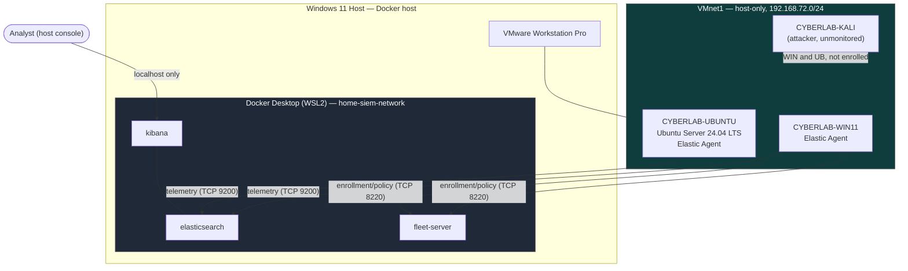

# Docker Deployment Guide

## 1. Purpose

This document defines the deployment strategy for hosting the Elastic Stack under Docker within the Home SIEM lab — the installation approach, directory and storage layout, resource and port planning, environment configuration, lifecycle management, logging, backup, and validation activities required before any container is created.

It is a companion to `04-docker-architecture.md`, not a replacement for it. `04-docker-architecture.md` defines *what* is being built — the container services, their responsibilities, network design, TLS model, and security controls. This document defines *how that plan gets deployed* — the practical rollout sequence, the host-side conventions, and the checks used to confirm the deployment succeeded. Where the two overlap, this document defers to `04-docker-architecture.md` as authoritative and cross-references it rather than restating it.

This is a design document. No Docker container, image, volume, or network described here has been created. Everything below describes intended deployment planning, to be executed in a later, implementation-focused phase — see `docs/implementation/implementation-log.md` for the chronological build record once that phase begins.

### Why containerization instead of dedicated virtual machines

The lab already uses VMware Workstation Pro to host three purpose-built virtual machines (`CYBERLAB-WIN11`, `CYBERLAB-UBUNTU`, `CYBERLAB-KALI`), each modeling a distinct role in the environment (`03-vm-specifications.md`). Adding a fourth, fifth, and sixth VM to run Elasticsearch, Kibana, and Fleet Server individually would triple the guest-OS overhead for services that do not need to model a distinct endpoint identity — none of them are meant to be monitored, attacked, or hardened as their own asset the way the endpoint VMs are.

Docker was chosen instead because the Elastic Stack's three services are backend infrastructure, not lab subjects: they benefit from fast startup, reproducible configuration through Docker Compose, and a shared, lightweight runtime, rather than from the isolation a full guest OS provides. This also keeps the stack within the host resource budget already planned in `03-vm-specifications.md` (Section 7) and `04-docker-architecture.md` (Section 12), which sizes the three lab VMs and the containerized stack to coexist on the same physical host rather than competing for a fourth full VM's worth of RAM and disk.

## 2. Deployment Architecture

The Docker host in this design is the **Windows 11 physical host machine**, running **Docker Desktop with the WSL2 backend**, consistent with `01-lab-overview.md` (Section 4) and `04-docker-architecture.md` (Section 2). Three long-running containers — `elasticsearch`, `kibana`, and `fleet-server` — are deployed on that host via Docker Compose, alongside a one-shot `setup` container used only for initialization. VMware Workstation Pro runs alongside Docker Desktop on the same host, hosting the lab's three virtual machines.

| Component | Role |
|---|---|
| Windows 11 host (Docker Desktop, WSL2 backend) | Docker host; runs the Elastic Stack containers |
| `elasticsearch` (container) | Central datastore for all endpoint telemetry, Fleet state, and detection alerts |
| `kibana` (container) | Analyst interface, dashboarding, and detection rule management |
| `fleet-server` (container) | Management control plane for enrolling and configuring Elastic Agents |
| `CYBERLAB-WIN11` (VM) | Windows endpoint running Fleet-managed Elastic Agent |
| `CYBERLAB-UBUNTU` (VM) | Ubuntu Server 24.04 LTS endpoint running Fleet-managed Elastic Agent |
| `CYBERLAB-KALI` (VM) | Attacker workstation; unmonitored, never enrolled in Fleet |

### Diagram: Deployment Architecture



Communication follows the flows already established in `02-network-topology.md` (Section 6) and `05-data-flow.md`: Elastic Agents on `CYBERLAB-WIN11` and `CYBERLAB-UBUNTU` enroll with and are managed by `fleet-server` over TCP 8220, and ship collected telemetry directly to `elasticsearch` over TCP 9200 — Fleet Server does not sit in the telemetry path. `kibana` queries `elasticsearch` over the private Docker network and is reachable only from the host's own loopback interface. `CYBERLAB-KALI` generates observable attack activity against the monitored endpoints but holds no credentials, enrollment, or network path to the stack itself.

## 3. Host Requirements

### Docker Host (Windows 11 Physical Host)

| Attribute | Value |
|---|---|
| Operating System | Windows 11 |
| CPU | AMD Ryzen 7 5700G (8 cores / 16 logical processors) |
| RAM | 32 GB |
| Container Runtime | Docker Desktop, WSL2 backend |
| Project Storage | `D:\CyberLab` |
| Coexisting Workload | VMware Workstation Pro, hosting `CYBERLAB-WIN11`, `CYBERLAB-UBUNTU`, `CYBERLAB-KALI` |

These figures match the host hardware already specified in `03-vm-specifications.md` (Section 2). They are sufficient for this deployment because the resource planning in `04-docker-architecture.md` (Section 12) sizes the Elastic Stack's combined container memory target at roughly 7 GB, against a host that has already reserved only 14 of its 32 GB for the three lab VMs — leaving a nominal 11 GB shared between the host OS, WSL2, Docker Desktop, and VMware Workstation Pro's own overhead. Similarly, the three VMs consume 8 of 16 logical processors (`03-vm-specifications.md`, Section 7), leaving the remaining 8 available to the host OS and the containerized stack. This is a home-lab planning target, not a guaranteed ceiling, and actual headroom is expected to be validated once the stack is running rather than assumed from these figures alone.

### Ubuntu Server 24.04 LTS Endpoint (reference only)

The lab's Ubuntu Server 24.04 LTS virtual machine, `CYBERLAB-UBUNTU`, is a separate component from the Docker host described above. It is a monitored endpoint that runs Fleet-managed Elastic Agent, not infrastructure that hosts the Elastic Stack. Its specification, already defined in `03-vm-specifications.md` (Section 5), is included here for completeness since it is part of the same deployment:

| Attribute | Value |
|---|---|
| Guest OS | Ubuntu Server 24.04 LTS |
| vCPU | 2 |
| RAM | 4 GB |
| Disk | 40 GB, thin provisioned |
| OpenSSH Server | Installed |
| Open VM Tools | Installed |
| NIC 1 | VMnet1 (host-only), static |
| NIC 2 | VMnet8 (NAT), DHCP |

This allocation is sized for a headless endpoint running Elastic Agent and auditd, not for hosting Elasticsearch, Kibana, or Fleet Server — those services carry materially higher memory and I/O requirements than this VM's budget provides, which is why the Docker host role remains with the Windows physical host rather than this VM.

## 4. Docker Installation Strategy

Docker on the host is provided by **Docker Desktop for Windows**, using the **WSL2 backend**, which bundles both the Docker Engine and the Docker Compose plugin as a single installation rather than requiring them to be installed and version-matched separately. Docker Desktop is obtained through Docker's official distribution channel, not a third-party mirror or package repository, to keep image and binary provenance consistent with the supply-chain expectations already set in `04-docker-architecture.md` (Section 15).

Version management is handled by Docker Desktop's own update mechanism rather than a manually maintained package pin — Docker Desktop tracks its own Engine and Compose plugin versions internally, distinct from the `STACK_VERSION` variable that governs the Elastic Stack images themselves (Section 9; `04-docker-architecture.md`, Section 16). The two version streams are independent: upgrading Docker Desktop does not change which Elastic Stack version is deployed, and vice versa.

Docker Desktop is configured to start automatically with Windows, so the containerized stack can resume after a host reboot without a manual launch step, consistent with the recovery expectations in `04-docker-architecture.md` (Section 13). Whether individual containers resume automatically once Docker Desktop is running is governed by each service's restart policy, addressed in Section 10 below. Installation commands and step-by-step setup are intentionally excluded here — they belong to the implementation log, not this planning document.

## 5. Directory Structure

Project files for this deployment live under the existing `home-siem` repository structure, using the `docker/` and `config/` directories already scaffolded in the repository:

```
home-siem/
├── docker/
│   ├── docker-compose.yml
│   ├── .env.example
│   ├── .env
│   ├── backups/
│   └── logs/
└── config/
    ├── elasticsearch/
    ├── kibana/
    └── fleet/
```

| Path | Purpose |
|---|---|
| `docker/docker-compose.yml` | Compose service definitions for `setup`, `elasticsearch`, `kibana`, and `fleet-server` (`04-docker-architecture.md`, Section 3) |
| `docker/.env.example` | Placeholder environment values, tracked in Git, documenting which variables a real deployment needs (Section 9) |
| `docker/.env` | Actual deployment values for this host; excluded from Git entirely (Section 9) |
| `docker/backups/` | Local staging area for exported Elasticsearch snapshots and Compose configuration backups (Section 13) |
| `docker/logs/` | Local staging area for exported Docker container logs, kept separate from the containers' own live logs (Section 12) |
| `config/elasticsearch/` | Version-controlled Elasticsearch configuration templates, mounted read-only into the container |
| `config/kibana/` | Version-controlled Kibana configuration templates, mounted read-only into the container |
| `config/fleet/` | Version-controlled Fleet Server configuration templates, mounted read-only into the container |

Deliberately absent from this tree is any `data/` directory for Elasticsearch, Kibana, or Fleet Server. Stateful, service-owned data — Elasticsearch indices, generated certificates, Kibana's runtime state, Fleet's persistent state — lives in Docker-managed named volumes (`es-data`, `certs`, `ca-public`, `es-certs`, `fleet-certs`, `kibana-certs`, `kibana-data`, `fleet-data`), per `04-docker-architecture.md` (Section 8), rather than under a host folder in this tree. Only version-controlled configuration and deployment-support artifacts (backups, exported logs) live under `home-siem/`; runtime data does not.

## 6. Persistent Storage Strategy

Two storage patterns are used for different kinds of content, consistent with `04-docker-architecture.md` (Section 8):

- **Named volumes** hold state that a service generates and manages itself: Elasticsearch's indices and cluster state, generated TLS certificates, and Kibana's and Fleet Server's internal runtime state. This is Docker-managed storage rather than a folder the analyst edits directly.
- **Read-only bind mounts** are reserved for repository-controlled configuration under `config/` (Section 5) — files meant to be inspected and edited as part of the project, mounted read-only so a container cannot silently modify what is supposed to be source-controlled.

Named volumes, not bind mounts, are the deliberate choice for all of Elasticsearch's stateful data. Elasticsearch's data must persist across container restarts and recreations — losing `es-data` would mean losing every indexed telemetry event, detection alert, and piece of Fleet state the lab has collected. Bind-mounting that data to a Windows-side directory was considered and rejected: Docker Desktop's WSL2 backend translates bind-mounted Windows paths through a virtualized filesystem boundary, which introduces file-locking and permission-translation behavior that a write-heavy database engine like Elasticsearch is not designed around. Keeping `es-data` in a named volume avoids that failure mode entirely by keeping the data inside Docker's own managed storage, native to the WSL2 filesystem.

Backup and recovery considerations therefore work at the volume level rather than the host-folder level: a named volume survives container removal and recreation by default (`04-docker-architecture.md`, Section 13), but recovering from a corrupted or accidentally deleted volume requires a deliberate backup mechanism, addressed in Section 13 below — volume persistence alone is not a backup strategy.

## 7. Network Design

Three network layers are involved, and this design keeps them deliberately separate (`02-network-topology.md`; `04-docker-architecture.md`, Section 6):

- **Internal Docker networking** — `elasticsearch`, `kibana`, and `fleet-server` all attach to a single private, user-defined bridge network (`home-siem-network`) and address each other by Docker service name rather than by IP address.
- **Host-only lab networking (VMnet1)** — the lab's monitored endpoints (`CYBERLAB-WIN11`, `CYBERLAB-UBUNTU`) and the attacker workstation (`CYBERLAB-KALI`) communicate over VMnet1, a static, gateway-less host-only segment with no route to the internet.
- **NAT networking (VMnet8)** — provides outbound-only internet access for OS and package updates on the lab VMs; it carries no Elastic Stack traffic.

`home-siem-network` has no direct relationship to either VMware network. The only bridge between Docker's internal networking and VMnet1 is the explicit set of host port bindings defined in Section 8 — Docker-internal addresses are never used in endpoint configuration, and the monitored VMs are always configured against the host's VMnet1 address (`192.168.72.1`), never a Docker network address.

## 8. Resource Allocation

| Service | CPU (planning target) | Memory (planning target) | Storage |
|---|---|---|---|
| `elasticsearch` | 2 vCPU | ~4 GB (JVM heap ~2 GB) | `es-data` named volume; grows with retained telemetry, subject to a retention policy not yet defined |
| `kibana` | 1 vCPU | ~2 GB | `kibana-data` named volume; minimal, version-dependent runtime state only |
| `fleet-server` | 1 vCPU | ~1 GB | `fleet-data` named volume; minimal persistent agent/Fleet state |

These figures extend the memory targets already established in `04-docker-architecture.md` (Section 12) with illustrative CPU planning shares. They are initial home-lab planning values, not enforced hard limits or production sizing guarantees, and are expected to be adjusted once real ingestion volume and query load are measured against the running stack. In a production deployment, these values would be revisited with dedicated capacity planning, high-availability replication, and formal retention policies — none of which are in scope for this single-node home lab (`01-lab-overview.md`, Section 9).

## 9. Port Allocation

| Service | Default Port | Purpose |
|---|---|---|
| Elasticsearch | 9200/TCP | Telemetry ingestion and API access from enrolled Elastic Agents |
| Kibana | 5601/TCP | Analyst interface and Fleet management UI |
| Fleet Server | 8220/TCP | Elastic Agent enrollment, policy delivery, and status reporting |

These ports match the service endpoints already defined in `01-lab-overview.md` (Section 4) and the host bindings in `04-docker-architecture.md` (Section 7): Elasticsearch and Fleet Server are bound to the host's VMnet1 address (`192.168.72.1`), and Kibana is bound to host loopback (`127.0.0.1`) only. Elasticsearch's transport port (9300) is intentionally not published to the host, since this single-node deployment has no need to expose inter-node transport traffic anywhere.

## 10. Environment Variables

An `.env` file centralizes deployment-specific configuration values so they are not hard-coded into `docker-compose.yml` itself. It is expected to hold values such as:

- `STACK_VERSION` — the single version value shared by the Elasticsearch, Kibana, and Elastic Agent/Fleet Server images, so all three stay mutually compatible (`04-docker-architecture.md`, Section 16).
- Host binding addresses (for example, the VMnet1 address used for Elasticsearch and Fleet Server bindings), so a change to the lab's addressing plan (`02-network-topology.md`, Section 3) requires updating one file rather than the Compose definition itself.
- Named volume and network naming, if parameterized, to keep the Compose file portable across environments.

A tracked `.env.example` file documents these variables with placeholder values only. The real `.env` file, containing actual deployment values for this host, is excluded from Git entirely. Consistent with `04-docker-architecture.md` (Section 10) and `06-security-architecture.md` (Section 11), no password, service token, enrollment token, API key, or certificate material belongs in either file — secrets are handled as a distinct concern, never as environment-variable configuration committed to, or templated in, this repository.

## 11. Container Lifecycle

The stack's intended lifecycle follows the startup dependency model already defined in `04-docker-architecture.md` (Section 5):

- **Initial deployment** — `docker-compose.yml` and `.env` are put in place, and the stack is brought up for the first time; the `setup` service performs certificate generation before any long-running service starts.
- **Startup** — `elasticsearch` starts and becomes healthy, Elasticsearch-dependent bootstrap actions complete, and `kibana` and `fleet-server` start only once that bootstrap state is ready.
- **Shutdown** — long-running services are stopped in a controlled manner; named volumes and their data are unaffected by a stop or removal of the containers themselves.
- **Restart** — following a host reboot or a deliberate restart, long-running services resume automatically per their restart policy, while one-shot services (`setup` and any Elasticsearch-dependent bootstrap step) run only when their required state is absent, never unconditionally on every restart (`04-docker-architecture.md`, Section 13).
- **Updates** — a version change to `STACK_VERSION` is a deliberate, planned action: backed up first (Section 13), tested, and only then treated as the new baseline — never an incidental side effect of a container recreation or an automatic image pull (`04-docker-architecture.md`, Section 16).
- **Recovery** — a corrupted or intentionally reset service requires deliberate removal and recreation of the affected named volume; this is treated as an explicit operation, never a byproduct of routine container lifecycle actions.

## 12. Logging Strategy

Two distinct categories of logging exist in this design, and they are not to be conflated:

- **Docker/container logs** — standard log output from `setup`, `elasticsearch`, `kibana`, and `fleet-server`, describing the health and behavior of the SIEM platform itself. These are accessed through standard Docker log tooling and are useful for diagnosing the stack's own operation.
- **Elasticsearch-ingested security telemetry** — Sysmon, Windows Event Logs, PowerShell logs, and Elastic Defend data from `CYBERLAB-WIN11`, and auditd, authentication, and system logs from `CYBERLAB-UBUNTU` (`01-lab-overview.md`; `05-data-flow.md`). This is the lab's actual monitored data, stored in Elasticsearch as data streams, not as container log output.

Container logs are ephemeral by default under Docker's standard logging driver. Where persistent retention of container logs is desired for troubleshooting history, they can be exported into `docker/logs/` (Section 5) as an explicit, occasional action rather than a continuously running process. Feeding the stack's own container logs into Elasticsearch for centralized self-monitoring is a plausible future enhancement, consistent with the incremental build-out philosophy in `01-lab-overview.md` (Section 8), but it is not part of the current design — introducing it would require its own data stream and dashboard planning, deferred to a later phase.

## 13. Backup Strategy

- **Elasticsearch data backups** — the mechanism for backing up `es-data` (for example, using Elasticsearch's own snapshot capability against a repository, or a volume-level export) is not yet fixed in this design; it depends on measuring real data volume once the stack is running, consistent with the deferred retention policy in `04-docker-architecture.md` (Section 8). Whatever mechanism is chosen, its output is expected to land in `docker/backups/` (Section 5) as a local, inspectable artifact.
- **Docker Compose configuration backups** — `docker-compose.yml` and `.env.example` are already backed up by virtue of being version-controlled in Git. The real `.env` file, containing deployment-specific (non-secret) values, is not tracked in Git and should be preserved separately if it is not trivially reconstructable from `.env.example`.
- **Recovery objectives** — this is a single-analyst home lab, not a production system with contractual uptime or data-loss commitments. Recovery point and recovery time expectations are informal: the goal is that a lost or corrupted `es-data` volume can be restored from the most recent backup without needing to re-derive the entire telemetry history from endpoint logs, most of which do not retain equivalent history locally (`05-data-flow.md`, Section 13).

## 14. Security Considerations

- **Principle of least privilege** — each container runs with only the access it needs; no container is privileged, and no container mounts the Docker socket (`04-docker-architecture.md`, Section 15).
- **Persistent data protection** — Elasticsearch data and TLS certificates live in named volumes rather than ad hoc host folders, keeping them under Docker's access control rather than exposed as plain Windows-side files (Section 6).
- **Container isolation** — all four services attach to a dedicated bridge network (`home-siem-network`) rather than the Docker default bridge, and private key material is split across per-service certificate volumes so no single container can read another's keys (`04-docker-architecture.md`, Section 8).
- **Image provenance** — only official Elastic and Docker images are used, pinned to a specific `STACK_VERSION` rather than the `latest` tag, keeping every deployment on a deliberately chosen, known version (`04-docker-architecture.md`, Section 16).
- **Network segmentation** — Elasticsearch and Fleet Server are reachable only from VMnet1 via explicit host bindings, and Kibana is reachable only from host loopback; no service is bound to the host's physical network interface (`06-security-architecture.md`, Section 7).
- **Future TLS implementation** — one-way TLS backed by a private lab certificate authority is planned for Elastic Agent, Fleet Server, and Elasticsearch communication, per `04-docker-architecture.md` (Section 9); certificate generation and distribution are implementation work, not covered here.
- **Future authentication hardening** — mutual TLS, a browser-trusted Kibana certificate, and finer-grained Kibana role definitions are identified as future improvements in `06-security-architecture.md` (Section 16), to be revisited once the initial deployment is validated.

Implementation steps for any of the above — certificate generation, firewall rule creation, credential provisioning — are out of scope for this document; they belong to the deployment's execution phase and its own implementation log.

## 15. Deployment Validation Plan

Once deployed, this rollout will be considered successful only after the following are confirmed — extending, rather than duplicating, the validation criteria already defined in `04-docker-architecture.md` (Section 17):

- Docker Desktop is running on the host, with the WSL2 backend active.
- All four expected containers (`setup`, `elasticsearch`, `kibana`, `fleet-server`) are present, with `setup` having exited successfully and the other three running and reporting healthy.
- Elasticsearch responds to API requests indicating the single-node cluster is ready to serve data.
- Kibana is accessible from the host at `127.0.0.1:5601` and functions as the analyst interface.
- Fleet Server reports as healthy in Fleet's own status view and is reachable from `CYBERLAB-WIN11` and `CYBERLAB-UBUNTU` over VMnet1.
- Named volumes (`es-data`, certificate volumes, `kibana-data`, `fleet-data`) survive a container restart and recreation without data loss.
- No lab service is reachable from the host's physical network interface or from VMnet8.

None of these checks have been performed yet, since no container has been created as of this document.

## 16. Future Deployment Phases

The following phases represent the planned rollout sequence for the Home SIEM lab. Each remains unchecked until implemented and validated against a running system, consistent with the implementation status already tracked in `01-lab-overview.md` (Section 11) and `docs/implementation/implementation-log.md`.

- [ ] Docker installation
- [ ] Elasticsearch deployment
- [ ] Kibana deployment
- [ ] Fleet Server deployment
- [ ] Elastic Agent (Ubuntu)
- [ ] Elastic Agent (Windows)
- [ ] Sysmon deployment
- [ ] Elastic Defend
- [ ] Detection rules
- [ ] Dashboards
- [ ] Kali attack simulations
